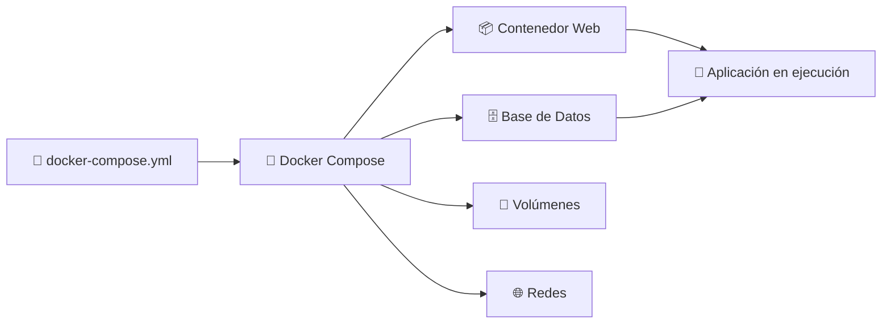
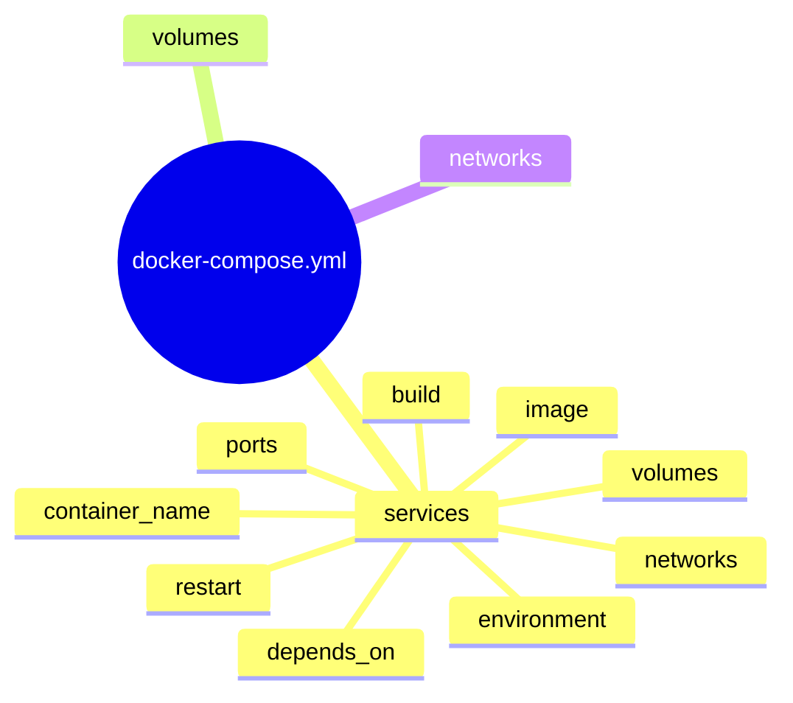

# 🐳 Docker Compose

> [!NOTE]
> **Curso:** Prácticas de DevOps utilizando Docker y GitFlow  
> **Unidad:** Orquestación básica de contenedores  
> **Tema:** Introducción a Docker Compose

---

# 🎯 Objetivos de aprendizaje

Al finalizar esta guía será capaz de:

- ✅ Comprender qué es Docker Compose.
- ✅ Identificar la estructura de un archivo `docker-compose.yml`.
- ✅ Definir múltiples servicios en un único archivo YAML.
- ✅ Configurar redes, volúmenes y variables de entorno.
- ✅ Comprender las principales directivas utilizadas en proyectos DevOps.

---

# 📖 ¿Qué es Docker Compose?

**Docker Compose** es una herramienta que permite **definir, configurar y ejecutar múltiples contenedores Docker** mediante un único archivo de configuración denominado **`docker-compose.yml`**.

En lugar de ejecutar numerosos comandos `docker run` con diferentes parámetros, Docker Compose centraliza toda la configuración en un archivo escrito en formato **YAML**, facilitando la administración, automatización y despliegue de aplicaciones compuestas por varios servicios.

> [!TIP]
> Docker Compose resulta especialmente útil cuando una aplicación está formada por varios componentes, por ejemplo:
>
> - 🌐 Servidor web
> - 🗄️ Base de datos
> - ⚡ API
> - 📦 Caché
> - 📊 Herramientas de monitoreo

---

# 🏗️ ¿Cómo funciona Docker Compose?

Docker Compose interpreta el archivo **`docker-compose.yml`**, crea automáticamente todos los recursos necesarios (redes, volúmenes y contenedores) y pone en marcha la aplicación completa mediante un único comando.



---

# 📂 Estructura básica de un archivo docker-compose.yml

```yaml
services:

  web:

    image: nginx:latest

    container_name: mi_web

    build: .

    ports:
      - "8080:80"

    volumes:
      - ./html:/usr/share/nginx/html

    environment:
      APP_ENV: production
      DEBUG: "false"

    depends_on:
      - db

    networks:
      - app_net

volumes:

  datos:

networks:

  app_net:

    driver: bridge
```

---

# 🔎 Componentes principales



---

# 📦 Sección **services**

La sección **`services`** define todos los contenedores que formarán parte de la aplicación.

Cada servicio representa un contenedor independiente.

Ejemplo:

```yaml
services:

  web:

    image: nginx

  db:

    image: postgres
```

En este caso Docker Compose desplegará dos contenedores:

- 🌐 Servidor web.
- 🗄️ Base de datos.

---

# 🖼️ image

Indica la imagen Docker que será utilizada para crear el contenedor.

```yaml
image: nginx:latest
```

También es posible utilizar imágenes como:

```yaml
image: postgres:15

image: redis:7

image: alpine
```

> [!TIP]
> Siempre que sea posible utilice versiones específicas (`postgres:15`) en lugar de `latest` para garantizar despliegues reproducibles.

---

# 🏗️ build

La opción **`build`** indica que Docker debe construir la imagen utilizando un **Dockerfile**.

```yaml
build: .
```

También puede especificarse un directorio diferente.

```yaml
build: ./backend
```

O una configuración más completa.

```yaml
build:

  context: .

  dockerfile: Dockerfile.dev
```

---

# 🌐 ports

Permite publicar puertos entre el sistema anfitrión y el contenedor.

```yaml
ports:

  - "8080:80"
```

Interpretación:

```text
HOST        CONTENEDOR

8080   --->     80
```

El servicio será accesible mediante:

```text
http://localhost:8080
```

---

# 💾 volumes

Los volúmenes permiten conservar información incluso cuando el contenedor es eliminado.

Ejemplo utilizando un **Bind Mount**:

```yaml
volumes:

  - ./html:/usr/share/nginx/html
```

Ejemplo utilizando un **Volumen Docker**:

```yaml
volumes:

  - datos:/var/lib/postgresql/data
```


---

# 🌎 environment

Permite definir variables de entorno para los contenedores.

```yaml
environment:

  POSTGRES_USER: admin

  POSTGRES_PASSWORD: admin123

  POSTGRES_DB: miapp
```

Estas variables son ampliamente utilizadas para configurar aplicaciones sin modificar el código fuente.

---

# 🔗 depends_on

Define dependencias entre servicios.

```yaml
depends_on:

  - db
```

En este ejemplo:

```text
Base de Datos

↓

Servidor Web
```

Docker Compose iniciará primero el servicio **db** y posteriormente el servicio **web**.

> [!IMPORTANT]
> `depends_on` únicamente controla el **orden de inicio** de los contenedores. No garantiza que un servicio esté completamente listo para recibir conexiones.

---

# 🌐 networks

Permite crear redes personalizadas para comunicar contenedores.

```yaml
networks:

  - app_net
```

Definición de la red:

```yaml
networks:

  app_net:

    driver: bridge
```


---

# 🔄 restart

Define la política de reinicio del contenedor.

Ejemplo:

```yaml
restart: always
```

Otras opciones disponibles son:

| Política | Descripción |
|----------|-------------|
| `no` | No reinicia automáticamente el contenedor. |
| `always` | Reinicia el contenedor siempre que se detenga. |
| `unless-stopped` | Reinicia el contenedor excepto cuando el usuario lo detiene manualmente. |
| `on-failure` | Reinicia únicamente cuando ocurre un error durante la ejecución. |

---

# 📚 Resumen de directivas

| Directiva | Descripción |
|-----------|-------------|
| 📦 `services` | Define los contenedores que forman parte de la aplicación. |
| 🖼️ `image` | Especifica la imagen Docker que utilizará el contenedor. |
| 🏗️ `build` | Construye una imagen utilizando un Dockerfile. |
| 🌐 `ports` | Publica puertos entre el host y el contenedor. |
| 💾 `volumes` | Configura almacenamiento persistente. |
| 🌎 `environment` | Define variables de entorno. |
| 🔗 `depends_on` | Establece dependencias entre servicios. |
| 🌐 `networks` | Asocia el servicio a una red Docker. |
| 🔄 `restart` | Configura la política de reinicio del contenedor. |
| 📛 `container_name` | Asigna un nombre personalizado al contenedor. |

---

# ⭐ Buenas prácticas DevOps

- 📄 Mantenga un único archivo `docker-compose.yml` por proyecto.
- 🏷️ Utilice versiones específicas de las imágenes Docker.
- 🌐 Cree redes personalizadas para aislar aplicaciones.
- 💾 Utilice volúmenes para almacenar datos persistentes.
- 🌎 Evite almacenar credenciales directamente en el archivo YAML; prefiera variables de entorno o archivos `.env`.
- 📦 Organice cada servicio de forma clara y documentada.
- 🔄 Configure políticas de reinicio apropiadas para entornos de producción.

---

# 💡 Conceptos clave

Al finalizar esta guía debe recordar que:

- 📄 Docker Compose permite administrar múltiples contenedores mediante un único archivo YAML.
- 🐳 Cada servicio representa un contenedor independiente.
- 🌐 Los servicios pueden comunicarse mediante redes Docker.
- 💾 Los volúmenes permiten conservar información persistente.
- ⚙️ Docker Compose simplifica el despliegue de aplicaciones multicontenedor y constituye una herramienta fundamental en entornos DevOps.
