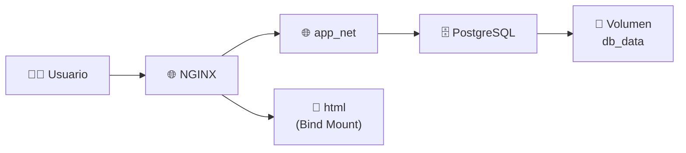
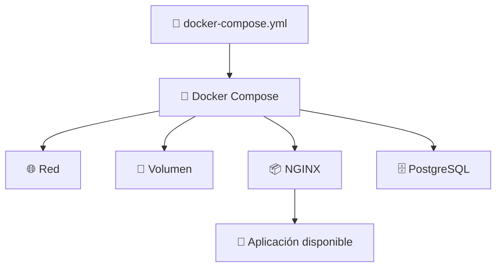

# 🚀 Laboratorio: Despliegue de una Aplicación Multicontenedor con Docker Compose

> [!NOTE]
> **Curso:** Prácticas de DevOps utilizando Docker y GitFlow  
> **Unidad:** Orquestación básica con Docker Compose  
> **Duración estimada:** 45 minutos  
> **Nivel:** Principiante

---

# 🎯 Objetivos de aprendizaje

Al finalizar este laboratorio será capaz de:

- ✅ Crear una estructura básica para un proyecto Docker Compose.
- ✅ Configurar un servidor web NGINX utilizando un **Bind Mount**.
- ✅ Desplegar una base de datos PostgreSQL mediante Docker Compose.
- ✅ Crear redes y volúmenes automáticamente.
- ✅ Administrar una aplicación multicontenedor utilizando Docker Compose.

---

# 📖 Introducción

En aplicaciones modernas es habitual que varios servicios trabajen de manera conjunta. Por ejemplo:

- 🌐 Un servidor web.
- 🗄️ Una base de datos.
- ⚡ Una API.
- 💾 Almacenamiento persistente.

Docker Compose permite definir todos estos servicios en un único archivo denominado **`docker-compose.yml`**, facilitando su despliegue y administración mediante un solo comando.

---

# 🏗️ Arquitectura del laboratorio



---

# 📋 Requisitos

Antes de iniciar el laboratorio verifique que dispone de:

- 🐳 Docker Engine instalado.
- 🐳 Docker Compose instalado.
- 💻 Terminal Linux.
- 🌐 Conexión a Internet.

---

# 📂 Parte 1. Preparación del proyecto

En esta actividad se preparará el contenido web que será publicado por NGINX.

---

## ▶️ Paso 1. Crear el directorio de trabajo

Ejecute:

```bash
mkdir -pv html
```

### 🔎 Explicación

| Parámetro | Descripción |
|-----------|-------------|
| `-p` | Crea el directorio únicamente si no existe. |
| `-v` | Muestra información durante la creación del directorio. |

---

## ▶️ Paso 2. Crear la página web

Ejecute:

```bash
echo "<h1>Hola desde Nginx con Docker Compose</h1>" > html/index.html
```

Verifique el contenido:

```bash
cat html/index.html
```

Resultado esperado:

```html
<h1>Hola desde Nginx con Docker Compose</h1>
```

> [!TIP]
> Este archivo será publicado automáticamente por NGINX mediante un **Bind Mount**.

---

# 📄 Parte 2. Crear el archivo docker-compose.yml

En el directorio del proyecto cree el archivo:

```text
docker-compose.yml
```

Con el siguiente contenido:

```yaml
services:

  web:
    image: nginx:latest
    container_name: mi_web

    ports:
      - "8800:80"

    volumes:
      - ./html:/usr/share/nginx/html

    networks:
      - app_net

  db:
    image: postgres:15
    container_name: mi_db

    environment:
      POSTGRES_USER: admin
      POSTGRES_PASSWORD: admin123
      POSTGRES_DB: miapp

    volumes:
      - db_data:/var/lib/postgresql/data

    networks:
      - app_net

volumes:

  db_data:

networks:

  app_net:
    driver: bridge
```

---

# 🔍 Analizando el archivo Compose

## 🌐 Servicio Web

```yaml
web:
```

Define un servicio basado en la imagen oficial de **NGINX**.

---

### Imagen

```yaml
image: nginx:latest
```

Docker descargará automáticamente la imagen oficial de Docker Hub si aún no existe localmente.

---

### Publicación de puertos

```yaml
ports:

  - "8800:80"
```

Esto significa:

```text
Host Linux

Puerto 8800
      │
      ▼
Contenedor

Puerto 80
```

La aplicación estará disponible mediante:

```text
http://localhost:8800
```

---

### Bind Mount

```yaml
volumes:

  - ./html:/usr/share/nginx/html
```

Permite publicar el contenido del directorio local:

```text
html/
```

directamente dentro del servidor web.


---

## 🗄️ Servicio PostgreSQL

El segundo servicio crea una base de datos PostgreSQL.

```yaml
db:
```

Utiliza la imagen:

```yaml
image: postgres:15
```

---

### Variables de entorno

```yaml
environment:

  POSTGRES_USER: admin

  POSTGRES_PASSWORD: admin123

  POSTGRES_DB: miapp
```

Estas variables permiten inicializar automáticamente la base de datos.

---

### Volumen persistente

```yaml
volumes:

  - db_data:/var/lib/postgresql/data
```

El volumen Docker **db_data** conservará la información aunque el contenedor sea eliminado.

---

### Red personalizada

Ambos servicios utilizan la misma red.

```yaml
networks:

  - app_net
```

Esto permite que NGINX y PostgreSQL puedan comunicarse utilizando sus nombres de servicio.

---

# 🚀 Parte 3. Desplegar la aplicación

## ▶️ Paso 1. Iniciar todos los servicios

Ejecute:

```bash
docker compose up -d
```

### ¿Qué hace Docker Compose?

Durante este proceso Docker realizará automáticamente las siguientes acciones:

- 📥 Descargar imágenes.
- 🌐 Crear la red.
- 💾 Crear el volumen.
- 📦 Crear los contenedores.
- 🚀 Iniciar la aplicación.



---

## ▶️ Paso 2. Verificar el sitio web

Abra el navegador.

```text
http://localhost:8800
```

Resultado esperado:

```text
Hola desde Nginx con Docker Compose
```

---

# 📄 Parte 4. Consultar registros

Para visualizar los registros generados por el servidor web ejecute:

```bash
docker compose logs web
```

> [!TIP]
> Los registros son una herramienta fundamental para diagnosticar problemas durante el despliegue de aplicaciones.

---

# 📋 Parte 5. Verificar los contenedores

Ejecute:

```bash
docker compose ps
```

Resultado esperado:

```text
NAME      STATUS

mi_web    Up

mi_db     Up
```

También puede utilizar:

```bash
docker ps
```

---

# ⏹️ Parte 6. Detener la aplicación

Cuando finalice el laboratorio detenga todos los servicios.

```bash
docker compose down
```

Este comando:

- 🛑 Detiene los contenedores.
- 🗑️ Elimina los contenedores.
- 🌐 Elimina la red creada automáticamente.

> [!NOTE]
> El volumen **db_data** permanecerá disponible.

---

# 🗑️ Parte 7. Eliminar también los volúmenes

Si desea eliminar completamente el entorno de trabajo ejecute:

```bash
docker compose down -v
```

Este comando eliminará:

- 📦 Contenedores.
- 🌐 Redes.
- 💾 Volúmenes persistentes.

> [!WARNING]
> Al eliminar los volúmenes se perderán permanentemente los datos almacenados en PostgreSQL.

---

# 📚 Resumen de comandos

| Comando | Descripción |
|----------|-------------|
| `mkdir -pv html` | Crea el directorio donde se almacenará la página web. |
| `docker compose up -d` | Crea e inicia todos los servicios en segundo plano. |
| `docker compose logs web` | Muestra los registros del servicio web. |
| `docker compose ps` | Lista los contenedores administrados por Docker Compose. |
| `docker compose down` | Detiene y elimina los contenedores y la red. |
| `docker compose down -v` | Elimina además los volúmenes persistentes. |

---

# ⭐ Buenas prácticas DevOps

- 📄 Mantenga un único archivo `docker-compose.yml` por proyecto.
- 🌐 Cree redes personalizadas para aislar aplicaciones.
- 💾 Utilice volúmenes para almacenar información persistente.
- 📂 Utilice **Bind Mounts** únicamente durante el desarrollo.
- 🏷️ Especifique versiones concretas de las imágenes (`postgres:15`) en lugar de `latest`.
- 🌎 Utilice archivos `.env` para almacenar credenciales sensibles.
- 📋 Verifique periódicamente los registros de los servicios mediante `docker compose logs`.

---

# 🏆 Actividad de reflexión

Responda las siguientes preguntas:

1. ¿Qué recursos crea automáticamente Docker Compose al ejecutar `docker compose up -d`?
2. ¿Cuál es la diferencia entre un **Bind Mount** y un **Volumen Docker** en este laboratorio?
3. ¿Por qué PostgreSQL utiliza un volumen persistente?
4. ¿Qué diferencia existe entre `docker compose down` y `docker compose down -v`?
5. ¿Qué ventajas ofrece Docker Compose frente a ejecutar múltiples comandos `docker run`?

---

# 🎓 Competencia DevOps

Al completar este laboratorio habrá desarrollado la capacidad de desplegar y administrar una aplicación multicontenedor utilizando Docker Compose, integrando servicios web, almacenamiento persistente y redes personalizadas mediante un único archivo de configuración, una práctica ampliamente utilizada en entornos DevOps y pipelines de Integración y Despliegue Continuos (CI/CD).
