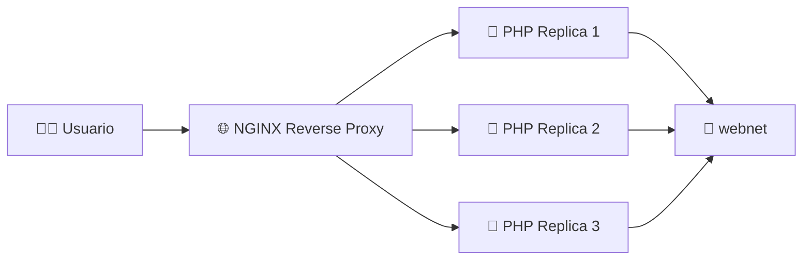
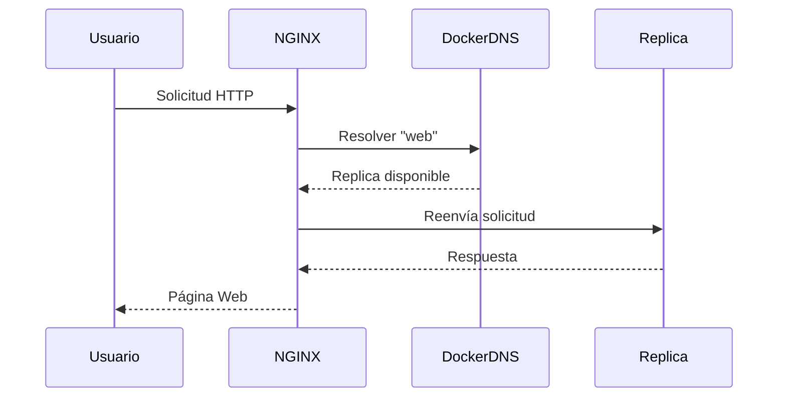
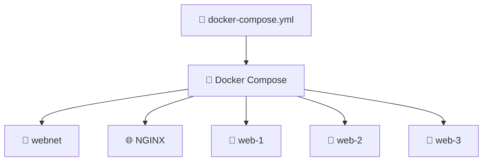
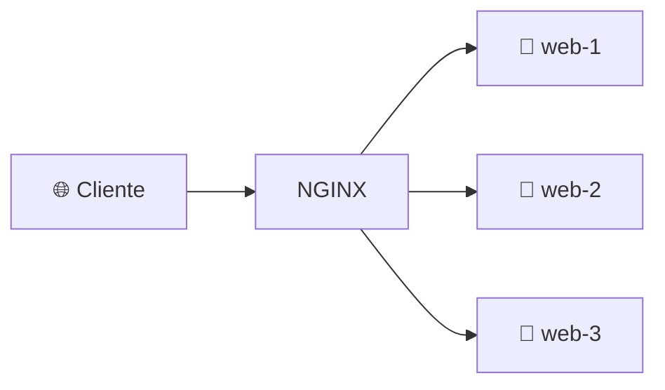

# ⚖️ Laboratorio: Escalado de una aplicación con Docker Compose, NGINX y PHP

> [!NOTE]
> **Curso:** Prácticas de DevOps utilizando Docker y GitFlow  
> **Unidad:** Docker Compose y Orquestación Básica  
> **Tema:** Escalamiento horizontal mediante Docker Compose y NGINX Reverse Proxy  
> **Duración estimada:** 45 minutos  
> **Nivel:** Intermedio

---

# 🎯 Objetivos de aprendizaje

Al finalizar este laboratorio será capaz de:

- ✅ Desplegar una aplicación multicontenedor utilizando Docker Compose.
- ✅ Configurar un **Reverse Proxy** con NGINX.
- ✅ Escalar un servicio mediante múltiples réplicas.
- ✅ Comprender cómo Docker Compose realiza el balanceo de carga utilizando DNS interno.
- ✅ Verificar la distribución de solicitudes entre diferentes contenedores.

---

# 📖 Introducción

Una de las principales ventajas de Docker Compose es la posibilidad de **escalar horizontalmente** un servicio mediante la creación de múltiples réplicas.

En este laboratorio se desplegarán:

- 🌐 Un servidor **NGINX** actuando como **Reverse Proxy**.
- 🐘 Tres contenedores **PHP-Apache** ejecutando la misma aplicación.
- 🌉 Una red Docker personalizada para permitir la comunicación entre todos los servicios.

Cuando un usuario acceda al sitio web, NGINX reenviará automáticamente las solicitudes hacia una de las réplicas disponibles.

---

# 🏗️ Arquitectura del laboratorio



---

# 📋 Requisitos

Antes de iniciar el laboratorio verifique que dispone de:

- 🐳 Docker Engine instalado.
- 🐳 Docker Compose instalado.
- 💻 Terminal Linux.
- 🌐 Conexión a Internet.

---

# 📁 Estructura del proyecto

Organice los archivos con la siguiente estructura:

```text
balanceador/

├── docker-compose.yml

├── nginx.conf

└── app/
    └── info.php
```

---

# 📄 Parte 1. Crear el archivo docker-compose.yml

Cree el archivo:

```text
docker-compose.yml
```

Con el siguiente contenido:

```yaml
services:

  web:
    image: php:8.2-apache

    volumes:
      - ./app:/var/www/html

    expose:
      - "80"

    networks:
      - webnet

  proxy:
    image: nginx:alpine

    ports:
      - "8088:80"

    volumes:
      - ./nginx.conf:/etc/nginx/nginx.conf:ro

    depends_on:
      - web

    networks:
      - webnet

networks:

  webnet:
    driver: bridge
```

---

# 🔎 Analizando la configuración

## 🐘 Servicio web

```yaml
web:
```

Utiliza la imagen oficial:

```yaml
php:8.2-apache
```

Cada réplica ejecutará un servidor Apache con soporte para PHP.

---

## 📂 Bind Mount

```yaml
volumes:

  - ./app:/var/www/html
```

Publica el contenido del directorio:

```text
app/
```

como directorio raíz del servidor web.

---

## 🌐 expose

```yaml
expose:

  - "80"
```

El puerto **80** será visible únicamente para los contenedores que pertenecen a la red Docker.

> [!NOTE]
> A diferencia de `ports`, la directiva `expose` no publica el puerto hacia el sistema anfitrión.

---

## 🌐 Servicio Proxy

El servicio **proxy** utiliza la imagen oficial de NGINX.

```yaml
proxy:
```

Publica el puerto:

```yaml
ports:

  - "8088:80"
```

Lo que significa:

```text
Host Linux

8088

↓

NGINX

80
```

El sitio web estará disponible mediante:

```text
http://localhost:8088
```

---

# 📄 Parte 2. Configurar NGINX

Cree el archivo:

```text
nginx.conf
```

Con el siguiente contenido:

```nginx
events {}

http {

    upstream backend {

        server web:80;

    }

    server {

        listen 80;

        location / {

            proxy_pass http://backend;

        }

    }

}
```

---

# 🔎 ¿Qué hace esta configuración?

## 🌐 upstream

```nginx
upstream backend {

    server web:80;

}
```

Define un grupo de servidores denominado **backend**.

En Docker Compose, el nombre:

```text
web
```

no representa un único contenedor, sino el **servicio completo**.

Cuando existen varias réplicas:

```bash
docker compose up -d --scale web=3
```

Docker responde mediante su servidor DNS interno con las diferentes direcciones IP de las réplicas disponibles.

---

## 🔄 proxy_pass

```nginx
proxy_pass http://backend;
```

Cada solicitud recibida por NGINX será enviada automáticamente hacia una de las réplicas del servicio **web**.

---

# 🏗️ Flujo de comunicación



---

# 📄 Parte 3. Crear la aplicación PHP

Dentro del directorio:

```text
app/
```

Cree el archivo:

```text
info.php
```

Con el siguiente contenido:

```php
<?php

echo "<h1>Hola desde la réplica: " . gethostname() . "</h1>";
```

---

# 💡 ¿Qué hace este código?

La función:

```php
gethostname()
```

obtiene el nombre del contenedor donde se ejecutó la solicitud.

Esto permitirá identificar qué réplica respondió cada petición.

---

# 🚀 Parte 4. Desplegar la aplicación

Ejecute:

```bash
docker compose up -d --scale web=3
```

---

## ¿Qué hace este comando?

Docker Compose realizará automáticamente las siguientes acciones:

- 📥 Descargar las imágenes necesarias.
- 🌉 Crear la red **webnet**.
- 📦 Crear el contenedor NGINX.
- 🐘 Crear tres réplicas del servicio PHP.
- 🚀 Iniciar toda la aplicación.



---

# 🔍 Parte 5. Verificar el despliegue

## ▶️ Mostrar los contenedores

```bash
docker compose ps
```

Resultado esperado:

```text
NAME

proxy-1

web-1

web-2

web-3
```

---

## ▶️ Acceder desde el navegador

Abra:

```text
http://localhost:8088/info.php
```

Obtendrá una respuesta similar a:

```text
Hola desde la réplica:

proyecto-web-1
```

Actualice varias veces la página.

Podrá observar respuestas como:

```text
Hola desde la réplica:

proyecto-web-2
```

y posteriormente:

```text
Hola desde la réplica:

proyecto-web-3
```

---

# ⚖️ Balanceo de carga



Cada solicitud puede ser enviada a una réplica diferente.

Esto constituye un mecanismo básico de **escalamiento horizontal**, ampliamente utilizado en aplicaciones de alta disponibilidad.

---

# 📄 Consultar los registros

Para visualizar los registros del proxy:

```bash
docker compose logs proxy
```

Para visualizar los registros del servicio PHP:

```bash
docker compose logs web
```

---

# 📚 Resumen de comandos

| Comando | Descripción |
|----------|-------------|
| `docker compose up -d --scale web=3` | Despliega la aplicación creando tres réplicas del servicio web. |
| `docker compose ps` | Lista los contenedores administrados por Docker Compose. |
| `docker compose logs proxy` | Muestra los registros del Reverse Proxy. |
| `docker compose logs web` | Muestra los registros de las réplicas PHP. |
| `docker compose down` | Detiene y elimina todos los servicios. |

---

# ⭐ Buenas prácticas DevOps

- 🌐 Utilice un **Reverse Proxy** para distribuir solicitudes entre múltiples servicios.
- 📈 Escale horizontalmente los servicios sin modificar la aplicación.
- 📦 Evite definir `container_name` cuando utilice `--scale`.
- 🌉 Utilice redes Docker personalizadas para facilitar la comunicación entre servicios.
- 📋 Supervise continuamente los registros mediante `docker compose logs`.
- 🏷️ Utilice versiones específicas de las imágenes Docker.

---

# 🏆 Actividad de reflexión

Responda las siguientes preguntas:

1. ¿Qué función cumple el servicio **proxy** dentro de la arquitectura?
2. ¿Por qué el servicio **web** utiliza `expose` en lugar de `ports`?
3. ¿Qué información proporciona la función `gethostname()`?
4. ¿Qué ventaja ofrece escalar un servicio mediante `--scale`?
5. ¿Por qué no es recomendable utilizar `container_name` cuando se crean múltiples réplicas?

---

# 🎓 Competencia DevOps

Al completar este laboratorio habrá adquirido las competencias necesarias para desplegar aplicaciones multicontenedor utilizando Docker Compose, implementar un **Reverse Proxy** con NGINX y escalar horizontalmente servicios mediante múltiples réplicas, una arquitectura ampliamente utilizada en plataformas de alta disponibilidad y entornos modernos de DevOps.
