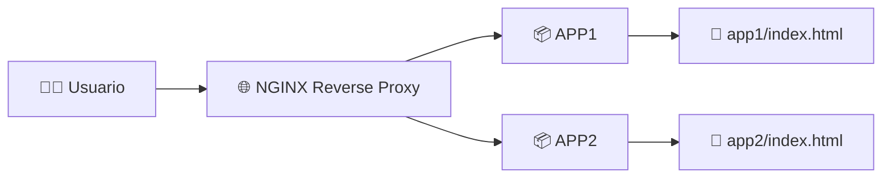
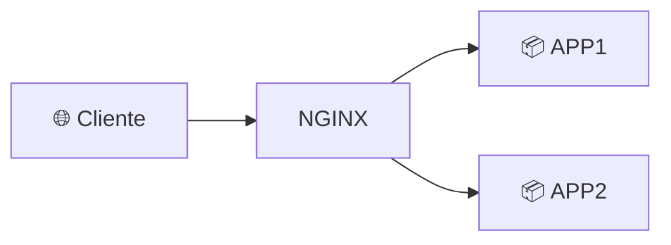
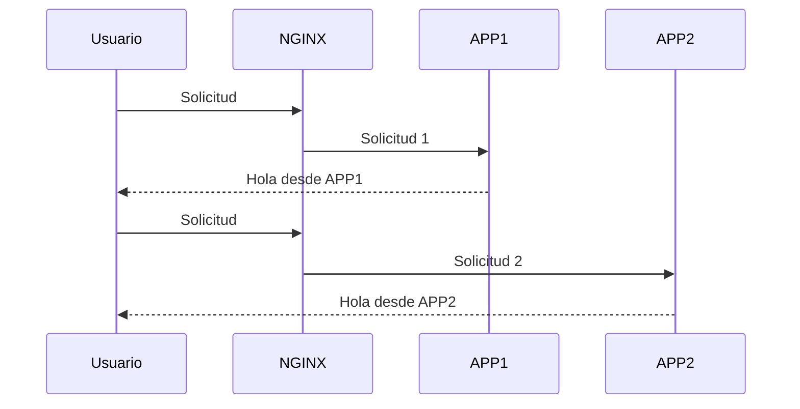
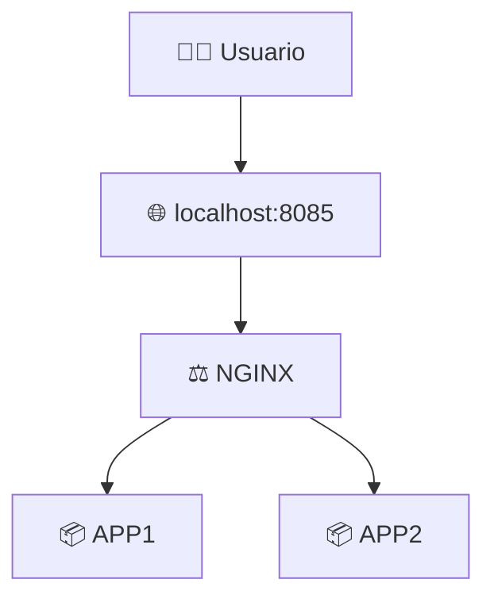

# ⚖️ Laboratorio: Balanceo de Carga con NGINX y Docker Compose

> [!NOTE]
> **Curso:** Prácticas de DevOps utilizando Docker y GitFlow  
> **Unidad:** Docker Compose y Orquestación Básica  
> **Tema:** Implementación de un balanceador de carga con NGINX  
> **Duración estimada:** 45 minutos  
> **Nivel:** Intermedio

---

# 🎯 Objetivos de aprendizaje

Al finalizar este laboratorio será capaz de:

- ✅ Desplegar múltiples aplicaciones web utilizando Docker Compose.
- ✅ Configurar un **Reverse Proxy** con NGINX.
- ✅ Implementar un balanceador de carga básico.
- ✅ Comprender el funcionamiento del algoritmo **Round Robin** de NGINX.
- ✅ Verificar la distribución de solicitudes entre múltiples aplicaciones.

---

# 📖 Introducción

En arquitecturas modernas es común desplegar varias instancias de una misma aplicación para mejorar la disponibilidad y distribuir la carga de trabajo.

En este laboratorio se implementará un **balanceador de carga** utilizando **NGINX**, el cual distribuirá las solicitudes HTTP entre dos aplicaciones web independientes.

La distribución se realizará mediante el algoritmo **Round Robin**, utilizado por defecto por NGINX.

---

# 🏗️ Arquitectura del laboratorio



---

# 📋 Requisitos

Antes de iniciar verifique que dispone de:

- 🐳 Docker Engine instalado.
- 🐳 Docker Compose instalado.
- 💻 Terminal Linux.
- 🌐 Conexión a Internet.

---

# 📁 Estructura del proyecto

Organice los archivos del laboratorio con la siguiente estructura:

```text
balanceador-nginx/

├── docker-compose.yml

├── nginx.conf

├── app1/
│   └── index.html

└── app2/
    └── index.html
```

---

# 📄 Parte 1. Crear el archivo docker-compose.yml

Cree el archivo:

```text
docker-compose.yml
```

Con el siguiente contenido:

```yaml
services:

  app1:
    image: nginx:alpine

    volumes:
      - ./app1:/usr/share/nginx/html

  app2:
    image: nginx:alpine

    volumes:
      - ./app2:/usr/share/nginx/html

  proxy:
    image: nginx:alpine

    volumes:
      - ./nginx.conf:/etc/nginx/nginx.conf:ro

    ports:
      - "8085:80"

    depends_on:
      - app1
      - app2
```

---

# 🔎 Analizando la configuración

## 📦 Servicio APP1

```yaml
app1:
```

Utiliza la imagen oficial:

```yaml
image: nginx:alpine
```

Publica el contenido del directorio:

```text
app1/
```

como sitio web.

---

## 📦 Servicio APP2

```yaml
app2:
```

Utiliza exactamente la misma imagen.

La única diferencia es que publica el contenido del directorio:

```text
app2/
```

---

## 🌐 Servicio Proxy

El servicio **proxy** será el único visible para los usuarios.

```yaml
proxy:
```

Publica el puerto:

```yaml
ports:

  - "8085:80"
```

Lo que significa:

```text
Host Linux

8085

↓

NGINX

80
```

Los usuarios accederán mediante:

```text
http://localhost:8085
```

---

## 🔗 depends_on

```yaml
depends_on:

  - app1

  - app2
```

Indica que el proxy debe iniciarse después de los servicios **APP1** y **APP2**.

---

# 📄 Parte 2. Configurar NGINX

Cree el archivo:

```text
nginx.conf
```

Con el siguiente contenido:

```nginx
events {}

http {

    upstream backend {

        server app1:80;

        server app2:80;

    }

    server {

        listen 80;

        location / {

            proxy_pass http://backend;

        }

    }

}
```

---

# 🔎 ¿Qué hace esta configuración?

## 🌐 upstream

```nginx
upstream backend {

    server app1:80;

    server app2:80;

}
```

Define un grupo de servidores denominado **backend**.

En este laboratorio el grupo está formado por:

- 📦 APP1
- 📦 APP2

---

## 🔄 proxy_pass

```nginx
proxy_pass http://backend;
```

Cada solicitud recibida por NGINX será enviada automáticamente a uno de los servidores definidos en el bloque **upstream**.

Por defecto, NGINX utiliza el algoritmo:

> **Round Robin**

Esto significa que las solicitudes se distribuyen de manera alternada entre los servidores disponibles.

---

# ⚖️ Balanceo de carga



---

# 📄 Parte 3. Crear las aplicaciones web

## 📁 APP1

Dentro del directorio:

```text
app1/
```

Cree el archivo:

```text
index.html
```

Con el siguiente contenido:

```html
<h1>Hola desde APP1</h1>
```

---

## 📁 APP2

Dentro del directorio:

```text
app2/
```

Cree el archivo:

```text
index.html
```

Con el siguiente contenido:

```html
<h1>Hola desde APP2</h1>
```

---

# 🚀 Parte 4. Desplegar la aplicación

Ejecute:

```bash
docker compose up -d
```

Durante este proceso Docker Compose realizará automáticamente:

- 📥 Descarga de las imágenes.
- 📦 Creación de APP1.
- 📦 Creación de APP2.
- 🌐 Creación del Reverse Proxy.

---

# 🔍 Parte 5. Verificar los contenedores

Ejecute:

```bash
docker compose ps
```

Resultado esperado:

```text
NAME

app1

app2

proxy
```

---

# 🌐 Parte 6. Probar el balanceador

Abra el navegador web.

```text
http://localhost:8085
```

Visualizará una de las aplicaciones.

Ejemplo:

```text
Hola desde APP1
```

---

## 🔄 Refrescar la página

Actualice varias veces el navegador utilizando la tecla:

```text
F5
```

o el botón **Actualizar** del navegador.

Observará que la respuesta alterna entre:

```text
Hola desde APP1
```

y

```text
Hola desde APP2
```

---

# 🧠 ¿Qué está ocurriendo?

Cada vez que se genera una nueva solicitud HTTP:



NGINX distribuye automáticamente las solicitudes entre los servidores disponibles utilizando el algoritmo **Round Robin**.

---

# 📊 Flujo completo



---

# 📄 Consultar los registros

Visualizar registros del proxy.

```bash
docker compose logs proxy
```

Visualizar registros de APP1.

```bash
docker compose logs app1
```

Visualizar registros de APP2.

```bash
docker compose logs app2
```

---

# ⏹️ Finalizar el laboratorio

Detener todos los servicios.

```bash
docker compose down
```

---

# 📚 Resumen de comandos

| Comando | Descripción |
|----------|-------------|
| `docker compose up -d` | Despliega todos los servicios del laboratorio. |
| `docker compose ps` | Lista los contenedores administrados por Docker Compose. |
| `docker compose logs proxy` | Muestra los registros del balanceador NGINX. |
| `docker compose logs app1` | Muestra los registros de APP1. |
| `docker compose logs app2` | Muestra los registros de APP2. |
| `docker compose down` | Detiene y elimina todos los servicios del laboratorio. |

---

# ⭐ Buenas prácticas DevOps

- 🌐 Utilice un **Reverse Proxy** para distribuir solicitudes entre múltiples servicios.
- 📈 Implemente balanceo de carga para mejorar la disponibilidad de las aplicaciones.
- 📦 Mantenga los servicios desacoplados mediante Docker Compose.
- 🌉 Utilice redes Docker para facilitar la comunicación entre contenedores.
- 📋 Supervise los registros del balanceador y de las aplicaciones.
- 🏷️ Utilice imágenes oficiales y versiones específicas cuando sea posible.

---

# 🏆 Actividad de reflexión

Responda las siguientes preguntas:

1. ¿Qué función cumple el bloque `upstream` dentro de NGINX?
2. ¿Qué algoritmo utiliza NGINX por defecto para distribuir solicitudes?
3. ¿Por qué únicamente el servicio **proxy** publica un puerto hacia el sistema anfitrión?
4. ¿Qué ocurriría si uno de los servidores backend dejara de responder?
5. ¿Qué ventajas ofrece un balanceador de carga dentro de una arquitectura basada en microservicios?

---

# 🎓 Competencia DevOps

Al completar este laboratorio habrá desarrollado las competencias necesarias para implementar un **balanceador de carga** utilizando NGINX y Docker Compose, comprendiendo cómo distribuir solicitudes entre múltiples aplicaciones mediante un **Reverse Proxy**, una arquitectura ampliamente utilizada en plataformas de alta disponibilidad y entornos modernos de DevOps.
