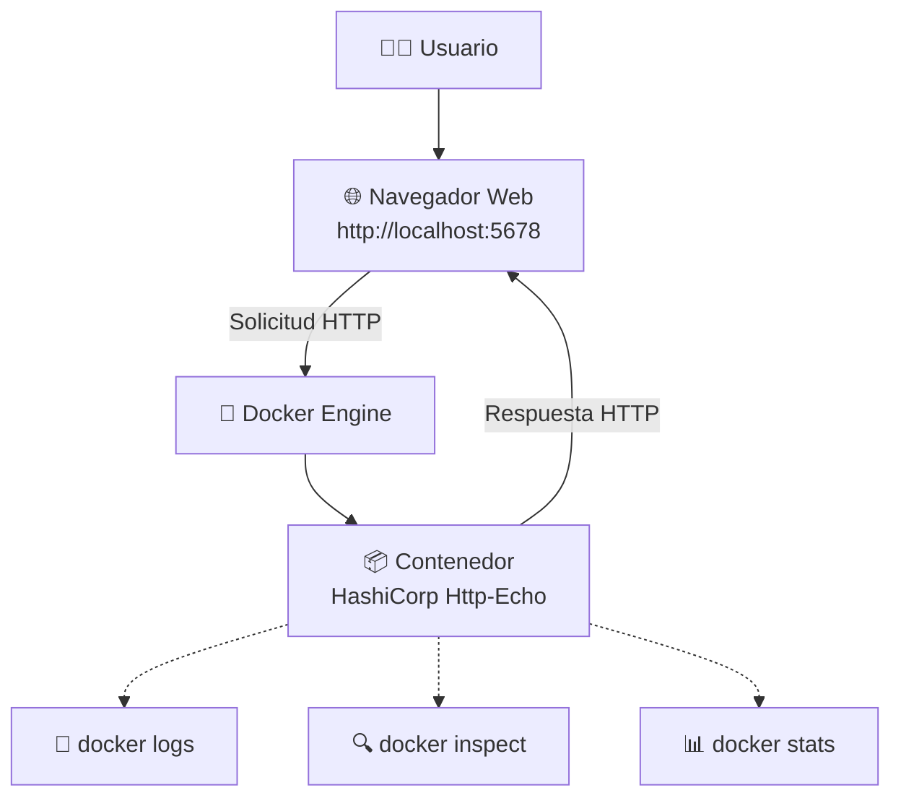
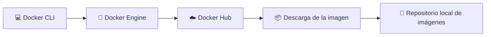
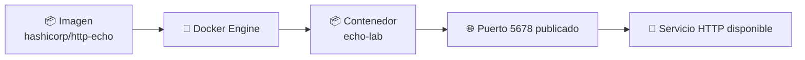
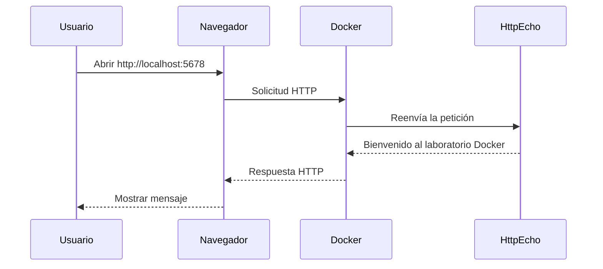
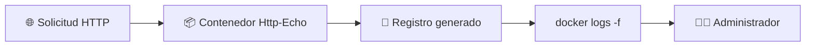
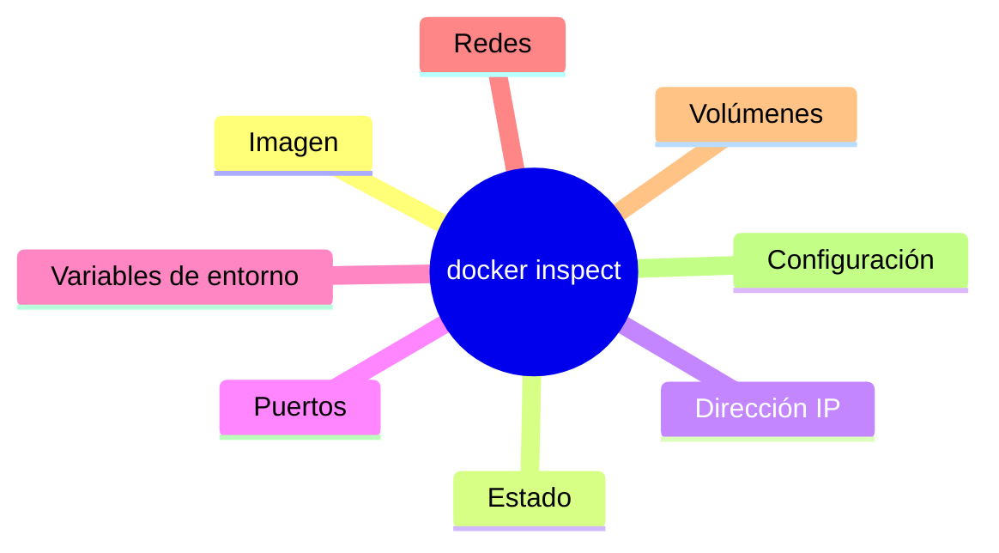
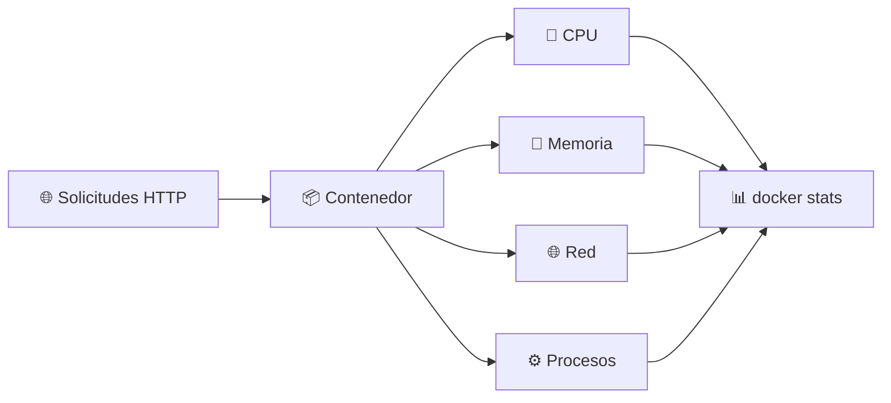
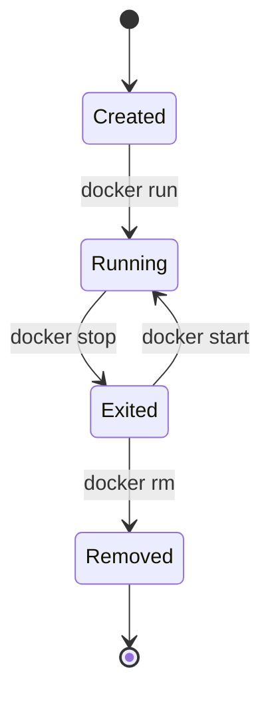
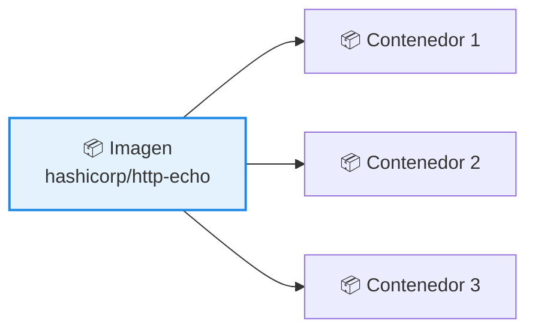

# 🚀 Laboratorio 1: Administración Básica de Contenedores con HashiCorp Http-Echo 

> [!NOTE]
> **Curso:** Prácticas de DevOps utilizando Docker y GitFlow  
> **Unidad:** Fundamentos y Arquitectura de Docker  
> **Duración estimada:** 60 minutos  
> **Nivel:** Principiante

---

# 🎯 Objetivos de aprendizaje

Al finalizar este laboratorio, el estudiante será capaz de:

- ✅ Desplegar un contenedor a partir de una imagen oficial de Docker Hub.
- ✅ Publicar un servicio HTTP utilizando Docker.
- ✅ Verificar el estado y ciclo de vida de un contenedor.
- ✅ Analizar los registros generados por una aplicación mediante `docker logs`.
- ✅ Inspeccionar la configuración interna de un contenedor con `docker inspect`.
- ✅ Monitorear el consumo de recursos utilizando `docker stats`.
- ✅ Detener y eliminar contenedores de forma segura.

---

# 📖 Introducción

En este laboratorio se utilizará la imagen oficial **HashiCorp Http-Echo**, una aplicación ligera desarrollada por HashiCorp que implementa un servidor HTTP cuyo propósito es responder cada solicitud con un mensaje previamente definido por el usuario.

Gracias a su simplicidad y reducido consumo de recursos, esta imagen es ampliamente utilizada para:

- 🌐 Verificar conectividad entre servicios.
- ⚖️ Validar configuraciones de balanceadores de carga.
- 🔌 Comprobar el funcionamiento de redes Docker.
- 🧪 Simular microservicios durante pruebas de integración.
- 🚀 Realizar demostraciones prácticas sobre el ciclo de vida de los contenedores.

Durante el desarrollo de este laboratorio se administrará el contenedor utilizando las principales herramientas de Docker, permitiendo comprender su funcionamiento y monitorear su comportamiento en tiempo real.

---

# 🏗 Arquitectura del laboratorio

El siguiente diagrama representa el flujo de interacción entre el usuario, Docker Engine y el contenedor **HashiCorp Http-Echo**.



> [!TIP]
> Durante este laboratorio se utilizarán tres herramientas fundamentales de administración de contenedores:
>
> - 📄 **docker logs:** consulta los registros generados por la aplicación.
> - 🔍 **docker inspect:** muestra la configuración interna y metadatos del contenedor.
> - 📊 **docker stats:** monitorea en tiempo real el consumo de CPU, memoria, red y disco.

---

# 🎓 Competencia DevOps

Al completar este laboratorio habrá adquirido las habilidades necesarias para desplegar, administrar e inspeccionar un contenedor Docker utilizando herramientas ampliamente empleadas en entornos de desarrollo, integración continua (CI) y despliegue continuo (CD).


---

# 📥 Parte 1. Descarga de la imagen

En esta primera actividad se descargará la imagen oficial **HashiCorp Http-Echo** desde **Docker Hub**. Posteriormente, se verificará que la imagen se encuentre disponible en el repositorio local del equipo.

> [!NOTE]
> Una **imagen Docker** es una plantilla de solo lectura que contiene todos los archivos, bibliotecas y dependencias necesarias para crear uno o varios contenedores.

---

## ▶️ Paso 1. Verificar las imágenes locales

Antes de descargar una nueva imagen, consulte cuáles se encuentran almacenadas en el equipo.

```bash
docker image ls
```

### Resultado esperado

Si es la primera vez que utiliza Docker, probablemente no se mostrará ninguna imagen o aparecerán únicamente las utilizadas en laboratorios anteriores.

> [!TIP]
> El comando `docker image ls` únicamente muestra las imágenes almacenadas localmente. No consulta Docker Hub.

---

## ▶️ Paso 2. Descargar la imagen desde Docker Hub

Ejecute el siguiente comando:

```bash
docker pull hashicorp/http-echo
```

Durante la descarga observará una salida similar a:

```text
Using default tag: latest
latest: Pulling from hashicorp/http-echo
Digest: sha256:xxxxxxxxxxxxxxxxxxxxxxxxxxxxxxxxxxxxxxxx
Status: Downloaded newer image for hashicorp/http-echo:latest
```

### ¿Qué ocurre internamente?

Cuando se ejecuta `docker pull`, Docker realiza automáticamente el siguiente proceso:



> [!IMPORTANT]
> Si la imagen ya existe localmente y corresponde a la versión más reciente, Docker no realizará una nueva descarga.

---

## ▶️ Paso 3. Verificar la descarga

Compruebe que la imagen se encuentra disponible.

```bash
docker image ls
```

Debe observar una salida similar a la siguiente:

```text
REPOSITORY               TAG       IMAGE ID       CREATED       SIZE
hashicorp/http-echo      latest    fcb75f691c8b   X weeks ago   16.7 MB
```

### Interpretación de las columnas

| Columna | Descripción |
|----------|-------------|
| **REPOSITORY** | Nombre del repositorio de la imagen. |
| **TAG** | Versión o etiqueta de la imagen. |
| **IMAGE ID** | Identificador único de la imagen. |
| **CREATED** | Fecha aproximada de creación de la imagen. |
| **SIZE** | Espacio ocupado por la imagen en el disco local. |

---

# 🚀 Parte 2. Creación del contenedor

Una vez descargada la imagen, se procederá a crear un contenedor que ejecutará un servidor HTTP capaz de responder con un mensaje personalizado.

> [!NOTE]
> Una misma imagen puede utilizarse para crear múltiples contenedores completamente independientes entre sí.

---

## ▶️ Paso 1. Crear el contenedor

Ejecute el siguiente comando:

```bash
docker run -d \
  --name echo-lab \
  -p 5678:5678 \
  hashicorp/http-echo \
  -listen=:5678 \
  -text="Bienvenido al laboratorio Docker"
```

Durante la ejecución, Docker devolverá un identificador similar al siguiente:

```text
4d1d0c2d95d9d6d9d2ab2d4ef2d7e5b2b7f5d1e8d0d5b4f3c2a1b0c9d8e7f6a5
```

Este identificador corresponde al **Container ID**, generado automáticamente por Docker.

---

## 🔍 Explicación del comando

| Parámetro | Descripción |
|-----------|-------------|
| `docker run` | Crea e inicia un nuevo contenedor a partir de una imagen Docker. |
| `-d` | Ejecuta el contenedor en segundo plano (*detached mode*), permitiendo continuar utilizando la terminal. |
| `--name echo-lab` | Asigna el nombre **echo-lab** al contenedor para facilitar su administración. |
| `-p 5678:5678` | Publica el puerto **5678** del contenedor en el puerto **5678** del equipo anfitrión. |
| `hashicorp/http-echo` | Imagen oficial utilizada para crear el contenedor. |
| `-listen=:5678` | Configura el servidor HTTP para escuchar solicitudes en el puerto 5678. |
| `-text="..."` | Define el mensaje que responderá el servidor HTTP a cada solicitud recibida. |

---

## 🏗 ¿Qué sucede durante la creación del contenedor?



> [!TIP]
> Observe que **la imagen no se modifica** durante este proceso. Docker crea un contenedor independiente utilizando la imagen como plantilla de referencia.

---

## 💡 Competencia DevOps

Al completar esta actividad habrá aprendido a:

- 📦 Descargar imágenes desde un registro público (Docker Hub).
- 🚀 Crear un contenedor a partir de una imagen oficial.
- 🌐 Publicar un servicio HTTP mediante el mapeo de puertos.
- 🏗 Comprender la relación entre **imagen**, **contenedor** y **servicio** dentro de la arquitectura Docker.

---


# 🔎 Parte 3. Verificación del estado del contenedor

Una vez creado el contenedor, el siguiente paso consiste en comprobar que se encuentra en ejecución y que el servicio HTTP está disponible para recibir solicitudes.

> [!NOTE]
> Docker permite consultar el estado de los contenedores mediante diferentes comandos. En esta práctica se utilizará `docker ps`, que muestra únicamente los contenedores que se encuentran en ejecución.

---

## ▶️ Paso 1. Consultar los contenedores activos

Ejecute el siguiente comando:

```bash
docker ps
```

### Resultado esperado

Deberá obtener una salida similar a la siguiente:

```text
CONTAINER ID   IMAGE                 COMMAND                  CREATED          STATUS          PORTS                                         NAMES
cdfda4b6005c   hashicorp/http-echo   "/http-echo -listen=…"   48 seconds ago   Up 44 seconds   0.0.0.0:5678->5678/tcp, [::]:5678->5678/tcp   echo-lab
```

### Interpretación de las columnas

| Columna | Descripción |
|----------|-------------|
| **CONTAINER ID** | Identificador único del contenedor. |
| **IMAGE** | Imagen utilizada para crear el contenedor. |
| **COMMAND** | Comando ejecutado al iniciar el contenedor. |
| **CREATED** | Tiempo transcurrido desde su creación. |
| **STATUS** | Estado actual del contenedor. |
| **PORTS** | Puertos publicados entre el contenedor y el equipo anfitrión. |
| **NAMES** | Nombre asignado al contenedor. |

> [!TIP]
> El comando `docker ps` únicamente muestra los contenedores que se encuentran en ejecución. Para visualizar también los contenedores detenidos utilice:
>
> ```bash
> docker ps -a
> ```

---

# 🌐 Parte 4. Verificación del servicio HTTP

Una vez confirmado que el contenedor se encuentra en ejecución, el siguiente paso consiste en comprobar que la aplicación responde correctamente a las solicitudes HTTP.

---

## ▶️ Paso 1. Acceder desde un navegador web

Abra su navegador e ingrese la siguiente dirección:

```text
http://localhost:5678
```

### Resultado esperado

La aplicación responderá con el mensaje configurado durante la creación del contenedor.

```text
Bienvenido al laboratorio Docker
```

---

## ▶️ Paso 2. Verificar mediante la terminal

También es posible realizar la misma comprobación utilizando la herramienta `curl`.

```bash
curl http://localhost:5678
```

### Resultado esperado

```text
Bienvenido al laboratorio Docker
```

> [!IMPORTANT]
> Tanto el navegador como `curl` realizan una solicitud HTTP al contenedor. La diferencia radica en que `curl` resulta especialmente útil para procesos de automatización, scripts y pruebas realizadas desde la línea de comandos.

---

## 🏗 Flujo de una solicitud HTTP



---

# 📄 Parte 5. Consulta de registros del contenedor

Toda aplicación genera información sobre su funcionamiento. Docker permite consultar dichos registros mediante el comando `docker logs`.

Esta funcionalidad resulta especialmente útil para diagnosticar errores, verificar solicitudes recibidas y analizar el comportamiento de una aplicación.

---

## ▶️ Paso 1. Mostrar los registros existentes

Ejecute:

```bash
docker logs echo-lab
```

### Resultado esperado

Se mostrará el historial de eventos registrados por la aplicación desde que el contenedor fue iniciado.

> [!NOTE]
> El contenido puede variar dependiendo del número de solicitudes HTTP realizadas hasta el momento.

---

## ▶️ Paso 2. Monitorear los registros en tiempo real

Abra una **segunda terminal** y ejecute el siguiente comando:

```bash
docker logs -tf echo-lab
```

### Explicación de los parámetros

| Parámetro | Descripción |
|-----------|-------------|
| `-t` | Muestra la fecha y hora asociada a cada registro generado. |
| `-f` | Mantiene la terminal escuchando continuamente los nuevos registros (*follow*). |

---

## ▶️ Paso 3. Generar nuevas solicitudes

Mientras el comando anterior permanece ejecutándose:

1. Actualice varias veces la página del navegador.
2. O bien ejecute repetidamente:

```bash
curl http://localhost:5678
```

Observe cómo cada nueva solicitud HTTP genera automáticamente un nuevo registro en la terminal.

---

## ▶️ Paso 4. Finalizar el monitoreo

Para detener la visualización en tiempo real, presione:

```text
Ctrl + C
```

---

## 🏗 Flujo de generación de registros



> [!TIP]
> El monitoreo mediante `docker logs -f` es una práctica habitual en entornos DevOps para verificar el funcionamiento de aplicaciones durante tareas de desarrollo, integración continua (CI), despliegue continuo (CD) y resolución de incidentes.

---

## 💡 Competencia DevOps

Al finalizar esta sección habrá aprendido a:

- 🔎 Verificar el estado operativo de un contenedor.
- 🌐 Validar el funcionamiento de un servicio HTTP.
- 📄 Consultar registros históricos de una aplicación.
- 📡 Monitorear en tiempo real los eventos generados por un contenedor.
- 🛠 Utilizar herramientas fundamentales para el diagnóstico y soporte de aplicaciones contenerizadas.

---


# 🔍 Parte 6. Inspección del contenedor

Una de las principales ventajas de Docker es la posibilidad de consultar detalladamente la configuración y el estado interno de un contenedor sin necesidad de acceder a él. Para ello se utiliza el comando `docker inspect`, que devuelve información en formato **JSON**.

> [!NOTE]
> `docker inspect` proporciona información sobre la configuración del contenedor, su red, volúmenes, variables de entorno, estado, puertos, imagen utilizada y muchos otros parámetros internos.

---

## ▶️ Paso 1. Consultar toda la información del contenedor

Ejecute:

```bash
docker inspect echo-lab
```

### Resultado esperado

Docker mostrará un documento en formato **JSON** con toda la información asociada al contenedor.

> [!TIP]
> La salida de `docker inspect` puede contener cientos de líneas. En la práctica profesional normalmente se filtran únicamente los campos de interés utilizando la opción `-f`.

---

## ▶️ Paso 2. Consultar la imagen utilizada

```bash
docker inspect \
-f '{{.Config.Image}}' \
echo-lab
```

### Resultado esperado

```text
hashicorp/http-echo
```

**¿Qué información proporciona?**

Permite identificar la imagen a partir de la cual fue creado el contenedor.

---

## ▶️ Paso 3. Consultar la dirección IPv4

```bash
docker inspect \
-f '{{range.NetworkSettings.Networks}}{{.IPAddress}}{{end}}' \
echo-lab
```

### Resultado esperado

```text
172.17.0.2
```

> [!NOTE]
> La dirección IP puede variar dependiendo de la configuración de la red Docker existente en el equipo.

---

## ▶️ Paso 4. Consultar los puertos publicados

```bash
docker inspect \
-f '{{json .NetworkSettings.Ports}}' \
echo-lab
```

### Resultado esperado

```json
{
  "5678/tcp": [
    {
      "HostIp": "0.0.0.0",
      "HostPort": "5678"
    }
  ]
}
```

Esta información permite verificar el mapeo existente entre el puerto del contenedor y el puerto publicado en el equipo anfitrión.

---

## ▶️ Paso 5. Consultar el estado del contenedor

```bash
docker inspect \
-f '{{.State.Status}}' \
echo-lab
```

### Resultado esperado

```text
running
```

Otros estados posibles son:

| Estado | Descripción |
|----------|-------------|
| `created` | El contenedor fue creado pero aún no se encuentra en ejecución. |
| `running` | El contenedor se encuentra ejecutándose correctamente. |
| `paused` | La ejecución del contenedor ha sido pausada temporalmente. |
| `restarting` | Docker está intentando reiniciar el contenedor. |
| `exited` | El contenedor finalizó su ejecución. |
| `dead` | El contenedor no pudo recuperarse correctamente. |

---

## 🏗 Información obtenida mediante `docker inspect`



> [!TIP]
> `docker inspect` es una de las herramientas más utilizadas durante actividades de diagnóstico, resolución de incidentes y soporte operativo en entornos DevOps.

---

# 📊 Parte 7. Monitoreo de recursos

Una vez desplegado el contenedor, es posible supervisar en tiempo real el consumo de recursos mediante el comando `docker stats`.

Esta herramienta permite conocer el comportamiento del contenedor mientras procesa solicitudes.

> [!IMPORTANT]
> El monitoreo continuo de CPU, memoria y red constituye una práctica habitual para detectar cuellos de botella, identificar sobrecarga y validar el rendimiento de aplicaciones contenerizadas.

---

## ▶️ Paso 1. Monitorear recursos en tiempo real

Ejecute:

```bash
docker stats
```

Mientras el comando permanece ejecutándose, actualice continuamente la siguiente dirección desde el navegador:

```text
http://localhost:5678
```

También puede generar tráfico utilizando:

```bash
curl http://localhost:5678
```

### Observe cómo varían las siguientes métricas

- 🧠 Utilización de CPU.
- 💾 Consumo de memoria.
- 🌐 Tráfico de red.
- 💽 Operaciones de entrada y salida.
- ⚙ Número de procesos.

---

## ▶️ Paso 2. Mostrar una única muestra

Cuando únicamente se requiere una captura instantánea del consumo de recursos, ejecute:

```bash
docker stats --no-stream
```

### Resultado esperado

```text
CONTAINER ID   NAME       CPU %   MEM USAGE / LIMIT   MEM %   NET I/O      BLOCK I/O   PIDS
```

Analice especialmente las siguientes columnas:

| Columna | Significado |
|----------|-------------|
| **CPU %** | Porcentaje de CPU utilizado por el contenedor. |
| **MEM USAGE / LIMIT** | Memoria utilizada y límite disponible para el contenedor. |
| **MEM %** | Porcentaje de memoria utilizada respecto al límite asignado. |
| **NET I/O** | Cantidad de datos recibidos y enviados por la interfaz de red del contenedor. |
| **PIDS** | Número de procesos o hilos en ejecución dentro del contenedor. |

---

## ▶️ Paso 3. Personalizar la salida

Docker permite mostrar únicamente la información necesaria utilizando plantillas.

Ejecute:

```bash
docker stats \
--format "table {{.Name}}\t{{.CPUPerc}}\t{{.MemUsage}}\t{{.NetIO}}"
```

### Resultado esperado

```text
NAME        CPU %     MEM USAGE      NET I/O

echo-lab    0.05%     4 MiB          8kB / 10kB
```

---

## 🏗 Flujo de monitoreo



---

## 💡 Competencia DevOps

Al finalizar esta sección habrá aprendido a:

- 🔍 Consultar la configuración interna de un contenedor utilizando `docker inspect`.
- 🌐 Verificar la dirección IP y los puertos publicados.
- 📊 Supervisar el consumo de CPU, memoria y red mediante `docker stats`.
- 📈 Interpretar métricas básicas de rendimiento para el diagnóstico y monitoreo de aplicaciones contenerizadas.

---


# ⏹️ Parte 8. Administración del ciclo de vida del contenedor

Durante su ejecución, un contenedor puede pasar por diferentes estados, como **ejecutándose**, **detenido** o **eliminado**. Docker proporciona comandos específicos para administrar cada una de estas etapas del ciclo de vida.

> [!NOTE]
> Detener un contenedor **no implica su eliminación**. Toda su configuración permanece almacenada y puede iniciarse nuevamente cuando sea necesario.

---

## 🏗 Ciclo de vida de un contenedor



---

# ▶️ Paso 1. Detener el contenedor

Para finalizar temporalmente la ejecución del contenedor, ejecute el siguiente comando:

```bash
docker stop echo-lab
```

### Resultado esperado

Docker devolverá el nombre del contenedor detenido.

```text
echo-lab
```

---

## ▶️ Paso 2. Verificar los contenedores en ejecución

Compruebe que el contenedor ya no se encuentra en ejecución.

```bash
docker ps
```

### Resultado esperado

El contenedor **echo-lab** no deberá aparecer en la lista.

> [!TIP]
> El comando `docker ps` únicamente muestra los contenedores que se encuentran en estado **Running**.

---

## ▶️ Paso 3. Mostrar todos los contenedores

Para visualizar también los contenedores detenidos, ejecute:

```bash
docker ps -a
```

### Resultado esperado

En la columna **STATUS** deberá observar un estado similar al siguiente:

```text
STATUS

Exited (0)
```

### ¿Qué significa `Exited (0)`?

El código **0** indica que el contenedor finalizó correctamente y sin errores.

Algunos códigos frecuentes son:

| Código | Significado |
|----------|-------------|
| **0** | Finalización correcta del proceso. |
| **1** | Error durante la ejecución. |
| **137** | El contenedor fue finalizado de forma forzada (`SIGKILL`). |
| **143** | El contenedor recibió una señal de detención (`SIGTERM`). |

---

# ▶️ Paso 4. Iniciar nuevamente el contenedor

Como el contenedor continúa existiendo, es posible volver a ejecutarlo sin necesidad de crearlo nuevamente.

Ejecute:

```bash
docker start echo-lab
```

### Resultado esperado

```text
echo-lab
```

---

## ▶️ Paso 5. Verificar nuevamente

Compruebe que el contenedor se encuentra otra vez en ejecución.

```bash
docker ps
```

Ahora deberá observar nuevamente el contenedor **echo-lab** con estado **Up**.

---

# 🗑️ Parte 9. Eliminación del contenedor

Cuando un contenedor deja de ser necesario, puede eliminarse para liberar recursos y mantener organizado el entorno Docker.

> [!IMPORTANT]
> Docker no permite eliminar un contenedor que se encuentra en ejecución. Primero debe detenerse utilizando `docker stop`.

---

## ▶️ Paso 1. Detener el contenedor

```bash
docker stop echo-lab
```

---

## ▶️ Paso 2. Eliminar el contenedor

Ejecute:

```bash
docker rm echo-lab
```

### Resultado esperado

```text
echo-lab
```

---

## ▶️ Paso 3. Verificar la eliminación

Compruebe que el contenedor ya no existe.

```bash
docker ps -a
```

El contenedor **echo-lab** ya no deberá aparecer en la lista.

---

## ⚠️ ¿La imagen también fue eliminada?

No.

La eliminación del contenedor **no elimina la imagen** utilizada para crearlo.

Puede comprobarlo mediante:

```bash
docker image ls
```

Deberá observar que la imagen **hashicorp/http-echo** continúa almacenada localmente y puede reutilizarse para crear nuevos contenedores.

---

## 🏗 Relación entre imágenes y contenedores



> [!TIP]
> Una única imagen puede utilizarse para crear múltiples contenedores independientes, cada uno con su propio estado, configuración y ciclo de vida.

---

# 🎓 Competencia DevOps

Al finalizar esta sección habrá aprendido a:

- ⏹️ Detener de forma controlada un contenedor.
- ▶️ Reiniciar un contenedor previamente detenido.
- 🗑️ Eliminar contenedores que ya no son necesarios.
- 🔄 Comprender el ciclo de vida de un contenedor Docker.
- 📦 Diferenciar claramente los conceptos de **imagen** y **contenedor**, fundamentales para la administración de aplicaciones contenerizadas.

---

# 📚 Resumen de comandos

| Comando | Descripción |
|----------|-------------|
| `docker image ls` | Lista las imágenes disponibles localmente. |
| `docker pull` | Descarga una imagen desde Docker Hub. |
| `docker run` | Crea e inicia un nuevo contenedor. |
| `docker ps` | Muestra los contenedores en ejecución. |
| `docker logs` | Consulta los registros generados por el contenedor. |
| `docker inspect` | Muestra información detallada del contenedor. |
| `docker stats` | Monitorea el consumo de recursos en tiempo real. |
| `docker stop` | Detiene un contenedor. |
| `docker start` | Inicia un contenedor detenido. |
| `docker rm` | Elimina un contenedor. |
