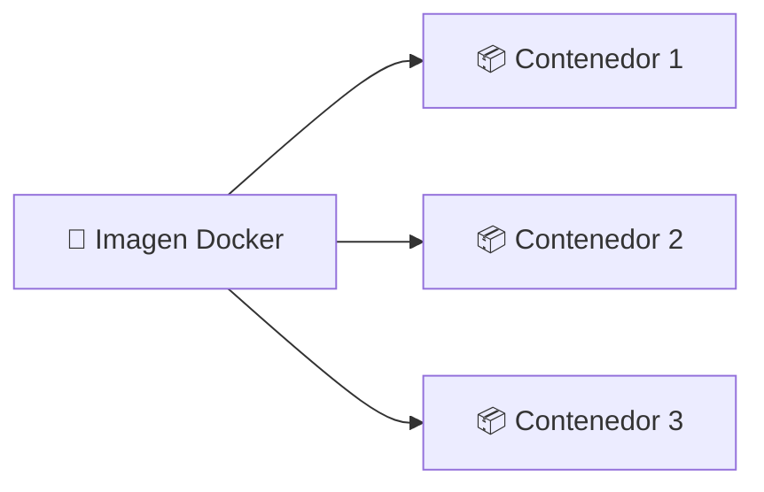
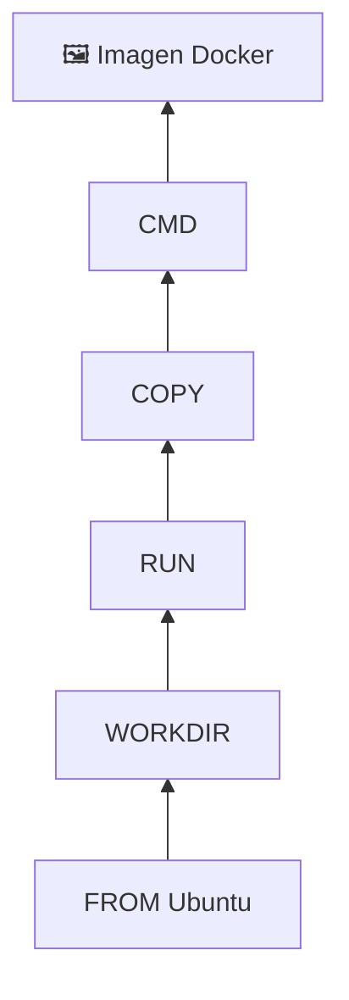
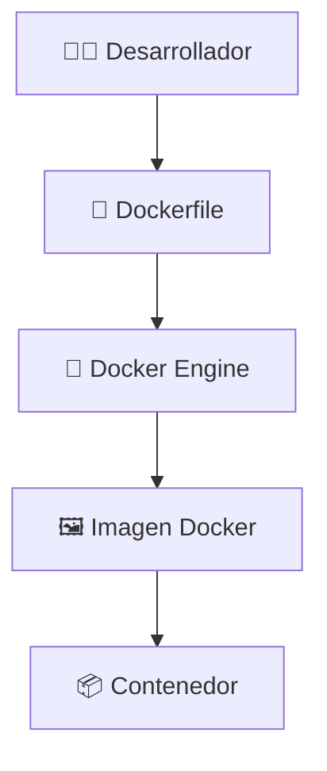
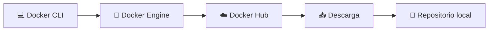

# 🐳 Imágenes en Docker

> [!NOTE]
> **Curso:** Prácticas de DevOps utilizando Docker y GitFlow  
> **Unidad:** Fundamentos y Arquitectura de Docker  
> **Tema:** Imágenes Docker y su administración

---

# 🎯 Objetivos de aprendizaje

Al finalizar esta guía será capaz de:

- ✅ Comprender qué es una imagen Docker y cuál es su función.
- ✅ Diferenciar una imagen de un contenedor.
- ✅ Identificar las principales características de las imágenes.
- ✅ Administrar imágenes mediante los comandos básicos de Docker.
- ✅ Descargar, listar y eliminar imágenes desde la línea de comandos.

---

# 📖 ¿Qué es una imagen Docker?

Una **imagen Docker** es una **plantilla inmutable** que contiene todos los elementos necesarios para ejecutar una aplicación dentro de un contenedor.

Incluye:

- 📦 Sistema de archivos.
- 📚 Bibliotecas y dependencias.
- ⚙️ Configuraciones.
- 🚀 Aplicación.
- ▶️ Instrucciones de ejecución.

Una imagen constituye el punto de partida para crear uno o varios contenedores.

> [!TIP]
> Una imagen **no se ejecuta** directamente. Primero debe utilizarse para crear un contenedor mediante el comando `docker run`.

---

# 🍽️ Imagen vs Contenedor

Una analogía sencilla consiste en comparar Docker con una receta de cocina.

| Imagen Docker | Contenedor Docker |
|---------------|-------------------|
| 📖 Receta | 🍽️ Plato preparado |
| Plantilla | Instancia en ejecución |
| Inmutable | Puede cambiar durante la ejecución |
| Se reutiliza | Se crea y elimina cuando sea necesario |



> [!NOTE]
> Una misma imagen puede utilizarse para crear múltiples contenedores completamente independientes.

---

# ✨ Características principales

Las imágenes Docker presentan varias características que las convierten en uno de los elementos fundamentales del desarrollo moderno de aplicaciones.

## 🧱 Construidas por capas (*Layers*)

Cada instrucción utilizada durante la construcción de una imagen genera una nueva capa.

Estas capas son reutilizables entre distintas imágenes.



---

## 🔒 Inmutabilidad

Una vez creada, una imagen no puede modificarse.

Si se requiere realizar un cambio, Docker construirá una nueva imagen.

---

## 🌍 Portabilidad

Las imágenes pueden compartirse fácilmente mediante registros como:

- Docker Hub
- GitHub Container Registry
- GitLab Container Registry
- Amazon ECR
- Azure Container Registry

Esto garantiza que una aplicación pueda ejecutarse de forma consistente en diferentes entornos.

---

## ⚡ Eficiencia

Docker reutiliza automáticamente las capas existentes para acelerar la construcción de nuevas imágenes.

Gracias a ello:

- disminuye el tiempo de construcción;
- reduce el consumo de almacenamiento;
- optimiza la transferencia entre equipos.

---

# 🏗️ Arquitectura de una imagen Docker



---

# 📚 Administración de imágenes

Docker proporciona varios comandos para administrar imágenes de forma sencilla.

> [!TIP]
> Antes de crear un contenedor es recomendable verificar si la imagen ya se encuentra disponible localmente.

---

# 📥 Descargar una imagen

El comando `docker pull` descarga una imagen desde un registro Docker.

## Sintaxis

```bash
docker pull <imagen>
```

## Ejemplo

```bash
docker pull ubuntu
```

Salida aproximada:

```text
Using default tag: latest

latest: Pulling from library/ubuntu

Digest: sha256:...

Status: Downloaded newer image for ubuntu:latest
```

### ¿Qué sucede internamente?



> [!IMPORTANT]
> Si la imagen ya existe localmente y corresponde a la versión más reciente, Docker no realizará una nueva descarga.

---

# 📋 Listar imágenes

Para visualizar todas las imágenes almacenadas localmente utilice:

```bash
docker image ls
```

También es válido:

```bash
docker images
```

Resultado esperado:

```text
REPOSITORY          TAG       IMAGE ID       CREATED       SIZE

ubuntu              latest    a04dc4851cbc   2 weeks ago   78MB

alpine              latest    91ef0af61f39   4 weeks ago   8MB
```

### Interpretación de las columnas

| Columna | Descripción |
|----------|-------------|
| **REPOSITORY** | Nombre del repositorio de la imagen. |
| **TAG** | Versión o etiqueta de la imagen. |
| **IMAGE ID** | Identificador único de la imagen. |
| **CREATED** | Fecha aproximada de creación de la imagen. |
| **SIZE** | Espacio ocupado por la imagen en disco. |

---

# 🗑️ Eliminar una imagen

Cuando una imagen deja de ser necesaria puede eliminarse mediante:

```bash
docker image rm ubuntu
```

También puede utilizarse:

```bash
docker rmi ubuntu
```

### Resultado esperado

```text
Untagged: ubuntu:latest

Deleted: sha256:...
```

> [!WARNING]
> Docker no permitirá eliminar una imagen que esté siendo utilizada por uno o más contenedores.

En ese caso aparecerá un mensaje similar a:

```text
Error response from daemon:

conflict: unable to remove repository reference
```

Primero deberá eliminar los contenedores asociados.

---

# 🧹 Eliminar imágenes no utilizadas

Docker permite liberar espacio eliminando automáticamente todas las imágenes que no están siendo utilizadas por ningún contenedor.

```bash
docker image prune -a
```

Antes de eliminar las imágenes, Docker solicitará confirmación.

```text
WARNING!

This will remove all images without at least one container associated to them.

Are you sure you want to continue? [y/N]
```

> [!TIP]
> Este comando resulta especialmente útil para liberar espacio en disco durante actividades de desarrollo y pruebas.

---

# 📚 Resumen de comandos

| Comando | Descripción |
|----------|-------------|
| `docker pull <imagen>` | Descarga una imagen desde Docker Hub. |
| `docker image ls` | Lista las imágenes disponibles localmente. |
| `docker images` | Comando equivalente para listar imágenes. |
| `docker image rm <imagen>` | Elimina una imagen específica. |
| `docker rmi <imagen>` | Forma abreviada para eliminar una imagen. |
| `docker image prune -a` | Elimina todas las imágenes que no están siendo utilizadas por contenedores. |

---

# ⭐ Buenas prácticas

- Utilice imágenes oficiales siempre que sea posible.
- Prefiera etiquetas de versión (`ubuntu:24.04`) en lugar de `latest` para garantizar reproducibilidad.
- Elimine periódicamente las imágenes que ya no utilice.
- Verifique el tamaño de las imágenes antes de incorporarlas a un proyecto.
- Mantenga únicamente las versiones necesarias en el equipo de desarrollo.

---

# 💡 Conceptos clave

Al finalizar esta guía debe recordar que:

- 📦 Una imagen es una plantilla inmutable.
- 📦 Una imagen puede generar múltiples contenedores.
- 🧱 Las imágenes están compuestas por capas reutilizables.
- 🌍 Las imágenes pueden compartirse mediante registros como Docker Hub.
- ⚙️ Docker proporciona comandos sencillos para descargar, listar y eliminar imágenes.

En la siguiente guía se estudiará cómo **crear imágenes personalizadas mediante Dockerfile**, comprendiendo el proceso completo de construcción y las principales instrucciones utilizadas durante su desarrollo.
