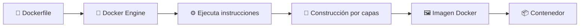
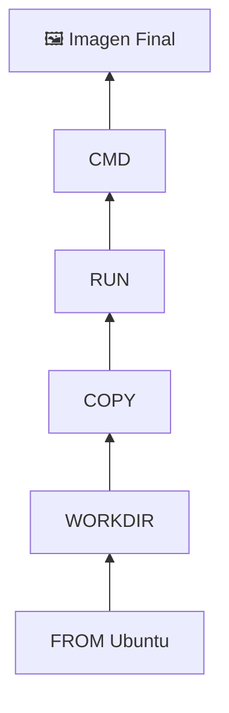
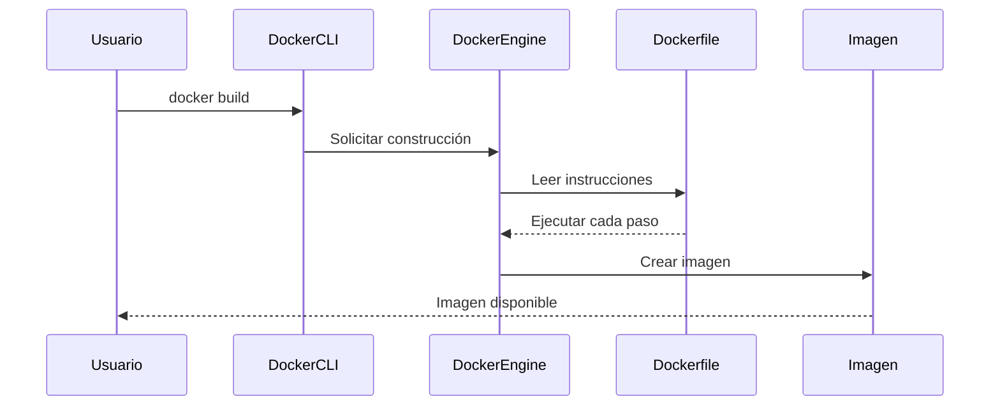

# 🏗️ Creación de Imágenes con Dockerfile

> [!NOTE]
> **Curso:** Prácticas de DevOps utilizando Docker y GitFlow  
> **Unidad:** Fundamentos y Arquitectura de Docker  
> **Tema:** Creación de imágenes personalizadas mediante Dockerfile

---

# 🎯 Objetivos de aprendizaje

Al finalizar esta guía será capaz de:

- ✅ Comprender el propósito de un Dockerfile.
- ✅ Identificar las principales instrucciones utilizadas durante la construcción de imágenes.
- ✅ Construir imágenes Docker personalizadas.
- ✅ Comprender el proceso de construcción por capas (*Layers*).
- ✅ Utilizar diferentes opciones del comando `docker build`.
- ✅ Verificar e inspeccionar imágenes generadas.

---

# 📖 ¿Qué es un Dockerfile?

Un **Dockerfile** es un archivo de texto plano que contiene las instrucciones necesarias para construir automáticamente una imagen Docker.

Cada línea representa una instrucción que Docker ejecutará secuencialmente hasta generar la imagen final.

> [!TIP]
> Un Dockerfile puede compararse con una **receta de cocina**. Cada instrucción representa un paso que Docker debe seguir para preparar una imagen.

---

# 🏗️ Proceso de construcción

Cuando se ejecuta el comando `docker build`, Docker interpreta el Dockerfile desde la primera hasta la última línea.



---

# 📂 Contexto de construcción

Al ejecutar un proceso de construcción, Docker necesita conocer qué archivos estarán disponibles para copiar dentro de la imagen.

Ese conjunto de archivos recibe el nombre de **Build Context**.

Normalmente corresponde al directorio actual.

```text
Proyecto/

│── Dockerfile

│── app.py

│── requirements.txt

└── templates/
```

Cuando se ejecuta

```bash
docker build .
```

Docker enviará todo ese directorio al Docker Engine.

> [!IMPORTANT]
>
> El punto (`.`) representa el **contexto de construcción**.

---

# 📑 Principales instrucciones de un Dockerfile

| Instrucción | Propósito | Ejemplo |
|-------------|-----------|---------|
| 📦 `FROM` | Define la imagen base. | `FROM ubuntu:24.04` |
| 📂 `WORKDIR` | Establece el directorio de trabajo. | `WORKDIR /app` |
| ⚙️ `RUN` | Ejecuta comandos durante la construcción. | `RUN apt update` |
| 📄 `COPY` | Copia archivos al contenedor. | `COPY . .` |
| 📥 `ADD` | Copia archivos o extrae comprimidos automáticamente. | `ADD proyecto.tar.gz /app` |
| 🌎 `ENV` | Define variables de entorno. | `ENV PORT=8080` |
| 🧩 `ARG` | Declara variables utilizadas durante la construcción. | `ARG VERSION=1.0` |
| 🌐 `EXPOSE` | Documenta el puerto utilizado por la aplicación. | `EXPOSE 80` |
| ▶️ `CMD` | Define el comando por defecto. | `CMD ["python","app.py"]` |
| 🚀 `ENTRYPOINT` | Establece el ejecutable principal del contenedor. | `ENTRYPOINT ["python"]` |

---

# 📝 Ejemplo de Dockerfile

```Dockerfile
FROM ubuntu:24.04

WORKDIR /app

COPY . .

RUN apt update && \
    apt install -y python3

CMD ["python3","app.py"]
```

---

# 🔎 Interpretación del Dockerfile

| Línea | Explicación |
|--------|-------------|
| `FROM ubuntu:24.04` | Utiliza Ubuntu 24.04 como imagen base. |
| `WORKDIR /app` | Define `/app` como directorio de trabajo. |
| `COPY . .` | Copia todos los archivos del proyecto. |
| `RUN apt update` | Actualiza el índice de paquetes. |
| `RUN apt install` | Instala Python dentro de la imagen. |
| `CMD` | Ejecuta la aplicación al iniciar el contenedor. |

---

# 🧱 Construcción por capas

Cada instrucción genera una nueva capa.



> [!NOTE]
>
> Docker reutiliza automáticamente las capas que no han cambiado para acelerar futuras construcciones.

---

# 🚀 Construir una imagen

## Sintaxis básica

```bash
docker build -t mi-imagen:1.0 .
```

---

## ¿Qué ocurre internamente?



---

## Explicación de los parámetros

| Parámetro | Descripción |
|------------|-------------|
| `docker build` | Construye una imagen. |
| `-t` | Asigna nombre y etiqueta. |
| `mi-imagen` | Nombre de la imagen. |
| `1.0` | Versión de la imagen. |
| `.` | Contexto de construcción. |

---

# 📁 Utilizar otro Dockerfile

Si el archivo posee otro nombre:

```bash
docker build -f Dockerfile.dev \
-t mi-imagen:dev .
```

Otro ejemplo:

```bash
docker build -f Dockerfile.prod \
-t mi-aplicacion:prod .
```

---

# 📂 Construir desde otro directorio

```bash
docker build -t mi-imagen ./proyecto
```

Docker buscará automáticamente:

```text
./proyecto/Dockerfile
```

---

# 🚫 Construcción sin utilizar caché

```bash
docker build --no-cache \
-t mi-imagen:1.0 .
```

Utilice esta opción cuando:

- 🔄 Se modificaron dependencias.
- 🐞 Se están realizando pruebas.
- 🔒 Se desea una reconstrucción completamente limpia.

---

# 📋 Mostrar el progreso detallado

```bash
docker build --progress=plain \
-t mi-imagen .
```

Ideal para laboratorios y procesos de depuración.

---

# 🏷️ Asignar múltiples etiquetas

```bash
docker build \
-t mi-imagen:1.0 \
-t mi-imagen:latest \
.
```

La imagen podrá utilizarse con cualquiera de las dos etiquetas.

---

# 🧪 Verificar la imagen

```bash
docker image ls
```

Resultado esperado

```text
REPOSITORY     TAG       IMAGE ID       CREATED         SIZE

mi-imagen      latest    a3b1c4d5e6f7   2 minutes ago   145MB
```

---

# 🔍 Inspeccionar una imagen

```bash
docker image inspect mi-imagen
```

Permite consultar:

- Identificador.
- Variables de entorno.
- Arquitectura.
- Sistema operativo.
- Capas.
- Fecha de creación.

---

# 📜 Consultar el historial

```bash
docker history mi-imagen
```

Ejemplo

```text
IMAGE          CREATED        CREATED BY

xxxxxxx        2 min ago      RUN apt install

xxxxxxx        3 min ago      COPY .

xxxxxxx        5 min ago      FROM ubuntu
```

---

# 🏷️ Crear una nueva etiqueta

```bash
docker tag mi-imagen:1.0 mi-imagen:latest
```

También puede prepararse para Docker Hub.

```bash
docker tag mi-imagen:1.0 usuario/mi-imagen:1.0
```

---

# 📚 Resumen de comandos

| Comando | Descripción |
|----------|-------------|
| `docker build -t nombre:tag .` | Construye una imagen. |
| `docker build -f Dockerfile.dev` | Utiliza otro Dockerfile. |
| `docker build --no-cache` | Ignora la caché. |
| `docker build --progress=plain` | Muestra el proceso completo. |
| `docker image ls` | Lista imágenes. |
| `docker image inspect` | Inspecciona una imagen. |
| `docker history` | Muestra las capas. |
| `docker tag` | Crea nuevas etiquetas. |

---

# ⭐ Buenas prácticas

- Utilice imágenes oficiales como base.
- Emplee versiones específicas (`ubuntu:24.04`) en lugar de `latest`.
- Organice las instrucciones para aprovechar la caché.
- Combine instrucciones `RUN` cuando sea posible.
- Mantenga un Dockerfile simple y legible.
- Versione siempre el Dockerfile junto con el código fuente.

---

# 💡 Conceptos clave

Al finalizar esta guía debe recordar que:

- 📄 El Dockerfile automatiza la creación de imágenes.
- 🧱 Cada instrucción genera una nueva capa.
- ⚡ Docker reutiliza las capas para acelerar las construcciones.
- 🏷️ Las etiquetas permiten gestionar diferentes versiones de una imagen.
- 🐳 Una imagen correctamente diseñada facilita el despliegue de aplicaciones en cualquier entorno.

---

# 🚀 Próximo tema

En la siguiente guía se estudiará cómo optimizar las imágenes utilizando **Multi-stage Builds**, una técnica ampliamente empleada para reducir el tamaño final de las imágenes y mejorar su seguridad.
