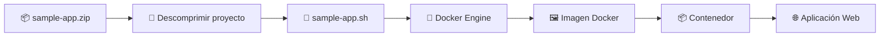
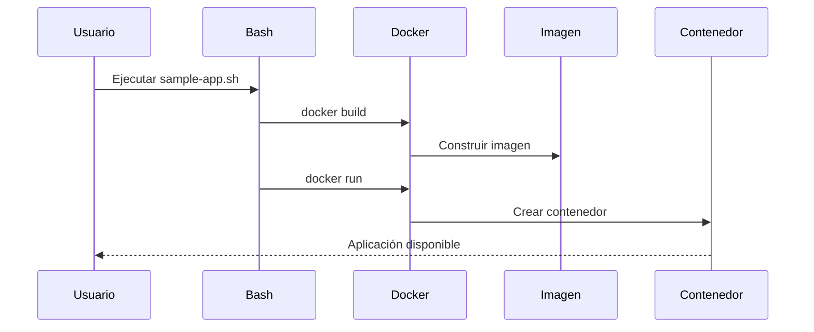
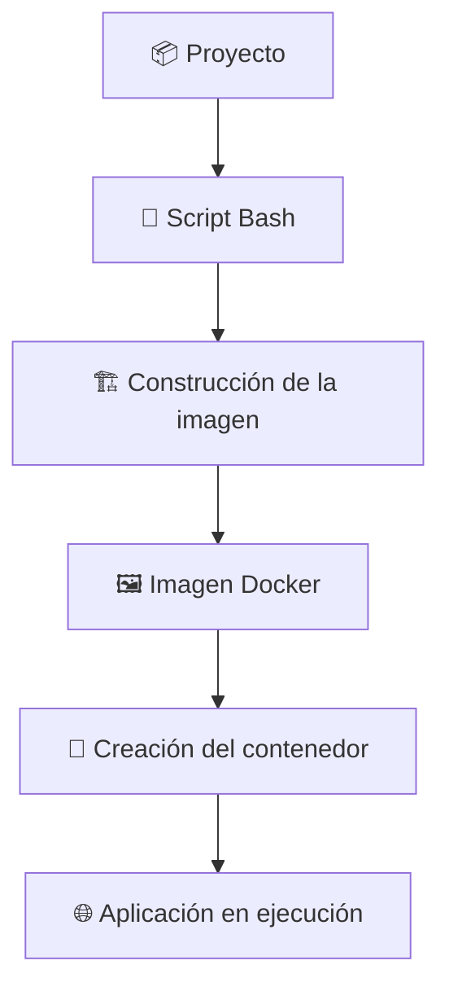

# 🚀 Laboratorio: Despliegue Automatizado de una Aplicación Web con Docker

> [!NOTE]
> **Curso:** Prácticas de DevOps utilizando Docker y GitFlow  
> **Unidad:** Creación y Gestión de Imágenes Docker  
> **Duración estimada:** 30 minutos  
> **Nivel:** Principiante

---

# 🎯 Objetivos de aprendizaje

Al finalizar este laboratorio, el estudiante será capaz de:

- ✅ Descargar y preparar un proyecto Docker.
- ✅ Descomprimir un paquete utilizando herramientas de Linux.
- ✅ Ejecutar un script de automatización desde la terminal.
- ✅ Construir automáticamente una imagen Docker.
- ✅ Desplegar un contenedor a partir de la imagen generada.
- ✅ Verificar el funcionamiento del despliegue mediante comandos Docker.

---

# 📖 Introducción

En proyectos DevOps es habitual automatizar tareas repetitivas mediante **scripts**. En este laboratorio se utilizará un script Bash que construirá automáticamente una imagen Docker y desplegará un contenedor sin necesidad de ejecutar manualmente todos los comandos.

Esta práctica permite comprender cómo la automatización simplifica el despliegue de aplicaciones y constituye la base de procesos de **Integración Continua (CI)** y **Despliegue Continuo (CD)**.

---

# 🏗️ Arquitectura del laboratorio



---

# 📋 Requisitos

Antes de iniciar el laboratorio verifique que dispone de:

- 🐳 Docker Engine instalado.
- 💻 Terminal Linux.
- 🌐 Conexión a Internet.
- 📦 Archivo **sample-app.zip**.

---

# 📥 Parte 1. Preparación del proyecto

## ▶️ Paso 1. Descargar el proyecto

Descargue el archivo:

```text
sample-app.zip
```

Guárdelo en el directorio de trabajo donde realizará el laboratorio.

> [!TIP]
> Puede verificar su ubicación utilizando el comando:

```bash
pwd
```

---

## ▶️ Paso 2. Verificar el archivo descargado

Ejecute:

```bash
ls
```

Debe observar un resultado similar a:

```text
sample-app.zip
```

---

# 📂 Parte 2. Extraer el proyecto

## ▶️ Paso 1. Descomprimir el archivo

Ejecute:

```bash
unzip sample-app.zip
```

### Resultado esperado

Se generará un nuevo directorio denominado:

```text
sample-app/
```

La estructura será similar a:

```text
sample-app/
├── sample-app.sh
├── sample-app.py
├── static
├── templates
└── tempdir

```

> [!NOTE]
> El contenido puede variar dependiendo de la versión del laboratorio.

---

## ▶️ Paso 2. Ingresar al proyecto

Cambie al directorio recién creado.

```bash
cd sample-app
```

Verifique el contenido.

```bash
ls
```

---

# ⚙️ Parte 3. Automatización del despliegue

En esta actividad se ejecutará un script Bash encargado de construir automáticamente la imagen Docker y crear el contenedor correspondiente.

---

## ▶️ Paso 1. Ejecutar el script

```bash
bash sample-app.sh
```

Durante la ejecución observará diferentes mensajes relacionados con:

- 📦 Construcción de la imagen Docker.
- 🏗️ Creación del contenedor.
- 🚀 Inicio automático de la aplicación.



> [!IMPORTANT]
> Dependiendo de la velocidad de conexión y del equipo utilizado, este proceso puede tardar algunos minutos durante la primera ejecución.

---

# 🔍 Parte 4. Verificación del despliegue

Una vez finalizado el script, es necesario comprobar que tanto la imagen como el contenedor fueron creados correctamente.

---

## ▶️ Paso 1. Verificar la imagen

Ejecute:

```bash
docker image ls
```

### Resultado esperado

Debe aparecer una imagen correspondiente a la aplicación.

Ejemplo:

```text
REPOSITORY          TAG       IMAGE ID       CREATED        SIZE
sample-app          latest    xxxxxxxxxxxx   2 minutes ago  xxx MB
```

> [!TIP]
> El nombre de la imagen puede variar dependiendo de la configuración utilizada en el script.

---

## ▶️ Paso 2. Verificar el contenedor

Ejecute:

```bash
docker ps -a
```

### Resultado esperado

```text
CONTAINER ID   IMAGE        STATUS      PORTS      NAMES
xxxxxxxxxxxx   sample-app   Up ...      ...        sample-app
```

Compruebe especialmente:

- ✅ El nombre del contenedor.
- ✅ La imagen utilizada.
- ✅ El estado (**Up**).
- ✅ Los puertos publicados.

---

# 💡 ¿Qué ocurrió durante la ejecución?

El script automatizó todas las tareas necesarias para desplegar la aplicación.



Esta automatización evita ejecutar manualmente cada uno de los comandos Docker, reduciendo errores y facilitando la repetibilidad del proceso.

---

# 📚 Resumen de comandos utilizados

| Comando | Descripción |
|----------|-------------|
| `unzip sample-app.zip` | Extrae el contenido del proyecto. |
| `cd sample-app` | Ingresa al directorio del proyecto. |
| `bash sample-app.sh` | Ejecuta el script de automatización. |
| `docker image ls` | Lista las imágenes Docker disponibles. |
| `docker ps -a` | Muestra todos los contenedores creados. |

---

# 🏆 Actividad de reflexión

Responda las siguientes preguntas:

1. ¿Qué ventajas ofrece utilizar un script para automatizar el despliegue de una aplicación?
2. ¿Qué diferencia existe entre la imagen generada y el contenedor creado?
3. ¿Qué comando utilizaría para verificar que el contenedor continúa ejecutándose?
4. ¿Por qué la automatización constituye uno de los principios fundamentales de DevOps?

---

# 🎓 Competencia DevOps

Al completar este laboratorio habrá adquirido la capacidad de ejecutar procesos automatizados para construir imágenes y desplegar contenedores Docker, una práctica ampliamente utilizada en pipelines de Integración Continua (CI) y Despliegue Continuo (CD).
