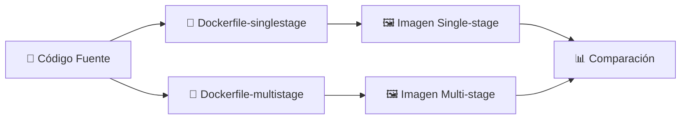
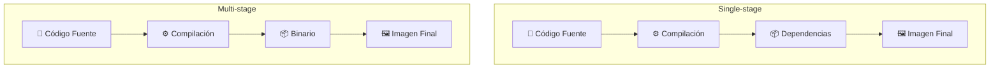

# 🚀 Laboratorio: Comparación entre Imágenes Single-stage y Multi-stage en Docker

> [!NOTE]
> **Curso:** Prácticas de DevOps utilizando Docker y GitFlow  
> **Unidad:** Optimización de imágenes Docker  
> **Tema:** Construcción de imágenes *Single-stage* y *Multi-stage*  
> **Duración estimada:** 30 minutos  
> **Nivel:** Intermedio

---

# 🎯 Objetivos de aprendizaje

Al finalizar este laboratorio será capaz de:

- ✅ Construir una imagen Docker utilizando un Dockerfile **Single-stage**.
- ✅ Construir una imagen Docker utilizando un Dockerfile **Multi-stage**.
- ✅ Comparar el tamaño de ambas imágenes.
- ✅ Comprender las ventajas de utilizar **Multi-stage Builds** en proyectos DevOps.

---

# 📖 Introducción

Durante el desarrollo de aplicaciones es habitual instalar compiladores, bibliotecas y herramientas temporales necesarias para construir el software. Sin embargo, estos componentes no son requeridos durante la ejecución de la aplicación y aumentan innecesariamente el tamaño de la imagen.

Docker permite resolver este problema mediante la técnica **Multi-stage Builds**, que consiste en separar la fase de compilación de la fase de ejecución, obteniendo imágenes mucho más pequeñas, seguras y eficientes.

En este laboratorio se construirán dos imágenes utilizando exactamente la misma aplicación:

- 📦 **Single-stage Build**
- 🚀 **Multi-stage Build**

Finalmente, se comparará el tamaño de ambas imágenes.

---

# 🏗️ Arquitectura del laboratorio



---

# 📋 Requisitos

Antes de iniciar el laboratorio verifique que dispone de:

- 🐳 Docker Engine instalado.
- 💻 Terminal Linux.
- 📂 Archivos:
  - `Dockerfile-singlestage`
  - `Dockerfile-multistage`
  - Código fuente de la aplicación.

---

# 📦 Parte 1. Construcción de la imagen Single-stage

En esta actividad se construirá una imagen utilizando un Dockerfile tradicional.

---

## ▶️ Paso 1. Construir la imagen

Ejecute:

```bash
docker build \
-t hello-singlestage \
-f Dockerfile-singlestage .
```

### 🔍 Explicación del comando

| Parámetro | Descripción |
|-----------|-------------|
| `docker build` | Construye una imagen Docker. |
| `-t hello-singlestage` | Asigna el nombre **hello-singlestage** a la imagen. |
| `-f Dockerfile-singlestage` | Utiliza el Dockerfile correspondiente al enfoque Single-stage. |
| `.` | Define el directorio actual como contexto de construcción. |

---

## ▶️ Paso 2. Esperar la construcción

Durante el proceso Docker ejecutará todas las instrucciones del Dockerfile.

Al finalizar observará un mensaje similar a:

```text
Successfully tagged hello-singlestage:latest
```

> [!TIP]
> Dependiendo del lenguaje utilizado y de la velocidad del equipo, este proceso puede tardar algunos minutos.

---

# 🚀 Parte 2. Construcción de la imagen Multi-stage

Ahora se construirá una segunda imagen utilizando la técnica **Multi-stage Build**.

---

## ▶️ Paso 1. Construir la imagen

```bash
docker build \
-t hello-multistage \
-f Dockerfile-multistage .
```

### 🔍 Explicación

En este caso Docker utilizará múltiples instrucciones `FROM`, separando la fase de compilación de la fase de ejecución.

Al finalizar deberá aparecer un mensaje similar a:

```text
Successfully tagged hello-multistage:latest
```

---

# 📊 Parte 3. Comparar las imágenes

Una vez construidas ambas imágenes, es posible comparar su tamaño.

---

## ▶️ Paso 1. Mostrar únicamente las imágenes del laboratorio

Ejecute:

```bash
docker images | grep hello-
```

> [!NOTE]
> El comando `grep hello-` filtra la salida para mostrar únicamente las imágenes cuyos nombres comienzan con **hello-**.

---

## ▶️ Paso 2. Analizar el resultado

Obtendrá una salida similar a:

```text
REPOSITORY           TAG       IMAGE ID       CREATED         SIZE

hello-singlestage    latest    xxxxxxxxxxxx   1 minute ago    320MB

hello-multistage     latest    yyyyyyyyyyyy   1 minute ago     18MB
```

> [!IMPORTANT]
> Los tamaños pueden variar dependiendo del lenguaje de programación, del sistema operativo base y de las dependencias utilizadas durante la construcción.

---

# 📈 Comparación conceptual

| Característica | Single-stage | Multi-stage |
|----------------|-------------|-------------|
| 📦 Tamaño de la imagen | Alto | Bajo |
| ⚡ Tiempo de descarga | Mayor | Menor |
| 🚀 Tiempo de despliegue | Mayor | Menor |
| 🔒 Superficie de ataque | Mayor | Menor |
| 📚 Incluye compiladores | Sí | No |
| 🏭 Recomendado para producción | ❌ | ✅ |

---

# 🔄 Flujo de construcción



---

# 💡 ¿Qué ocurrió?

Durante el proceso **Single-stage**, todas las herramientas necesarias para compilar la aplicación permanecen dentro de la imagen final.

En cambio, durante el proceso **Multi-stage**, únicamente se copia el artefacto necesario para ejecutar la aplicación, descartando compiladores, bibliotecas temporales y archivos intermedios.

Como resultado se obtiene una imagen:

- 📦 Más pequeña.
- ⚡ Más rápida de descargar.
- 🔒 Más segura.
- 🚀 Más eficiente para producción.

---

# 📚 Resumen de comandos

| Comando | Descripción |
|----------|-------------|
| `docker build -t hello-singlestage -f Dockerfile-singlestage .` | Construye la imagen Single-stage. |
| `docker build -t hello-multistage -f Dockerfile-multistage .` | Construye la imagen Multi-stage. |
| `docker images` | Lista todas las imágenes Docker. |
| `docker images \| grep hello-` | Filtra únicamente las imágenes del laboratorio. |

---

# ⭐ Buenas prácticas DevOps

- 🚀 Utilice **Multi-stage Builds** para imágenes destinadas a producción.
- 📦 Elimine herramientas de compilación de la imagen final.
- 🏷️ Utilice etiquetas de versión en lugar de `latest` cuando sea posible.
- 📉 Mantenga las imágenes lo más pequeñas posible para reducir tiempos de despliegue.
- 🔒 Minimice la superficie de ataque eliminando dependencias innecesarias.

---

# 🏆 Actividad de reflexión

Responda las siguientes preguntas:

1. ¿Cuál fue la diferencia de tamaño entre ambas imágenes?
2. ¿Por qué la imagen Multi-stage es más pequeña?
3. ¿Qué componentes permanecen en una imagen Single-stage y desaparecen en una Multi-stage?
4. ¿Cuál de las dos imágenes utilizaría para un entorno de producción? Justifique su respuesta.
5. ¿Qué beneficios aporta una imagen más pequeña dentro de un pipeline CI/CD?

---

# 🎓 Competencia DevOps

Al completar este laboratorio habrá desarrollado la capacidad de construir y comparar imágenes Docker utilizando las estrategias **Single-stage** y **Multi-stage**, comprendiendo por qué esta última constituye una de las principales buenas prácticas para el desarrollo, distribución y despliegue de aplicaciones contenerizadas en entornos DevOps.
