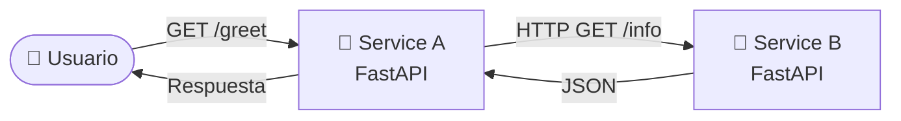
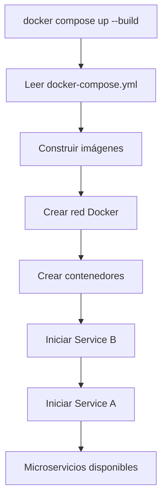

# 🐳 Laboratorio: Comunicación entre Microservicios con Docker Compose


---

# 📖 Descripción

En este laboratorio se implementará una arquitectura compuesta por **dos microservicios** que se comunican entre sí utilizando la red interna creada automáticamente por **Docker Compose**.

El objetivo es comprender cómo los contenedores pueden descubrirse utilizando el nombre del servicio sin necesidad de conocer direcciones IP, aplicando principios fundamentales de las arquitecturas basadas en microservicios.

---

# 🎯 Objetivos

Al finalizar este laboratorio el estudiante será capaz de:

- 🐳 Construir imágenes Docker para múltiples microservicios.
- ⚙️ Orquestar servicios mediante Docker Compose.
- 🌐 Comprender el funcionamiento de la red interna creada por Docker Compose.
- 🔄 Implementar comunicación entre microservicios mediante HTTP.
- 🌱 Aplicar el uso de variables de entorno para desacoplar la configuración.
- 📜 Analizar los registros generados por cada servicio.

---

# 🏗️ Arquitectura



Docker Compose crea automáticamente una red privada donde **service-a** puede localizar a **service-b** utilizando únicamente su nombre.

---

# 📁 Estructura del proyecto

```text
📁 micro1
├── 📁 service-a
│   ├── 📄 app.py
│   ├── 📄 Dockerfile
│   └── 📄 requirements.txt
│
├── 📁 service-b
│   ├── 📄 app.py
│   ├── 📄 Dockerfile
│   └── 📄 requirements.txt
│
└── 📄 docker-compose.yml

```

---

# 🚀 Paso 1. Crear el microservicio B

Este servicio será el encargado de proporcionar información que posteriormente será consumida por el microservicio A.

Archivo:

```text
service-b/app.py
```

```python
from fastapi import FastAPI

app = FastAPI()

@app.get("/info")
def info():
    return {
        "service": "B",
        "message": "Hola desde Service B"
    }
```

---

## 📦 requirements.txt

```text
fastapi
uvicorn[standard]
```

---

## 🐳 Dockerfile

```dockerfile
FROM python:3.11-slim

WORKDIR /app

COPY requirements.txt .

RUN pip install --no-cache-dir -r requirements.txt

COPY . .

EXPOSE 8001

CMD ["uvicorn","app:app","--host","0.0.0.0","--port","8001"]
```

---

# 🚀 Paso 2. Crear el microservicio A

Este servicio consumirá el endpoint del microservicio B.

Archivo

```text
service-a/app.py
```

```python
from fastapi import FastAPI
import os
import requests

app = FastAPI()

SERVICE_B = os.getenv(
    "SERVICE_B_URL",
    "http://service-b:8001"
)

@app.get("/greet")
def greet():

    try:

        respuesta = requests.get(
            f"{SERVICE_B}/info",
            timeout=2
        )

        datos = respuesta.json()

    except Exception as e:

        datos = {
            "service": "B",
            "message": f"Error: {e}"
        }

    return {

        "service": "A",

        "downstream": datos

    }
```

---

## 📦 requirements.txt

```text
fastapi
uvicorn[standard]
requests
```

---

## 🐳 Dockerfile

```dockerfile
FROM python:3.11-slim

WORKDIR /app

COPY requirements.txt .

RUN pip install --no-cache-dir -r requirements.txt

COPY . .

EXPOSE 8000

CMD ["uvicorn","app:app","--host","0.0.0.0","--port","8000"]
```

---

# ⚙️ Paso 3. Crear Docker Compose

Archivo

```text
docker-compose.yml
```

```yaml
services:

  service-b:

    build: ./service-b

    container_name: service-b

    ports:

      - "8001:8001"

  service-a:

    build: ./service-a

    container_name: service-a

    ports:

      - "8000:8000"

    depends_on:

      - service-b

    environment:

      SERVICE_B_URL: http://service-b:8001
```

---

# 💡 ¿Qué hace Docker Compose?

Cuando se ejecuta el proyecto:

```bash
docker compose up --build
```

Docker Compose realiza automáticamente las siguientes tareas:



---

# 🌐 ¿Cómo encuentran los servicios a sus vecinos?

Uno de los aspectos más importantes de Docker Compose es que crea un **DNS interno**.

Por ello:

```text
service-a
```

puede comunicarse con

```text
service-b
```

simplemente utilizando:

```text
http://service-b:8001
```

No es necesario conocer direcciones IP.

---

# ▶️ Paso 4. Desplegar el laboratorio

Desde la carpeta principal ejecutar:

```bash
docker compose up --build
```

Docker Compose:

- 📦 Construirá ambas imágenes.
- 🌐 Creará la red.
- ▶️ Iniciará los dos contenedores.

---

# 🔍 Paso 5. Verificar los servicios

Consultar:

```bash
docker compose ps
```

Resultado esperado:

```text
NAME          STATUS

service-a     Up

service-b     Up
```

---

# 🌍 Paso 6. Probar la comunicación

Abrir el navegador:

```text
http://localhost:8000/greet
```

Respuesta esperada:

```json
{
    "service": "A",
    "downstream": {
        "service": "B",
        "message": "Hola desde Service B"
    }
}
```

---

También es posible consultar directamente:

```text
http://localhost:8001/info
```

Resultado:

```json
{
    "service":"B",
    "message":"Hola desde Service B"
}
```

---

# 📜 Paso 7. Ver los registros

Visualizar todos los logs:

```bash
docker compose logs
```

Visualizar en tiempo real:

```bash
docker compose logs -f
```

Observar cómo aparecen las solicitudes realizadas entre ambos servicios.

---

# 🧪 Paso 8. Simular un fallo

Detener únicamente el microservicio B.

```bash
docker stop service-b
```

Consultar nuevamente:

```text
http://localhost:8000/greet
```

Ahora el microservicio A responderá mostrando el mensaje de error capturado por la excepción.

---

# ▶️ Paso 9. Recuperar el servicio

```bash
docker start service-b
```

Consultar nuevamente:

```text
http://localhost:8000/greet
```

La comunicación volverá a establecerse correctamente.

---

# 🧹 Paso 10. Finalizar el laboratorio

```bash
docker compose down
```

---

# 📚 Conceptos DevOps aplicados

| Concepto | Aplicación |
|-----------|------------|
| 🐳 Contenedores | Cada microservicio se ejecuta en su propio contenedor. |
| 🌐 Redes Docker | Docker Compose crea una red privada automáticamente. |
| ⚙️ Variables de entorno | El endpoint del servicio B no está codificado. |
| 🔄 Desacoplamiento | Cada servicio puede evolucionar de forma independiente. |
| 📦 Dockerfile | Cada servicio construye su propia imagen. |
| 📜 Logs | Docker centraliza los registros de ambos servicios. |

---

# 💡 Buenas prácticas observadas

- ✅ Un proceso por contenedor.
- ✅ Variables de entorno para la configuración.
- ✅ Comunicación mediante nombres de servicio.
- ✅ Separación de responsabilidades.
- ✅ Docker Compose como orquestador básico.
- ✅ Imágenes independientes para cada servicio.

---

# 🧠 Actividades propuestas

Realice las siguientes actividades:

- Agregue un nuevo endpoint `/health` en ambos microservicios.
- Incorpore un tercer microservicio denominado **service-c**.
- Modifique el mensaje devuelto por **service-b**.
- Agregue un **Healthcheck** a ambos servicios en `docker-compose.yml`.
- Configure el reinicio automático mediante `restart: always`.
- Observe el comportamiento de los logs cuando un servicio deja de responder.

---

# ❓ Preguntas de reflexión

1. ¿Por qué `service-a` puede localizar a `service-b` sin conocer su dirección IP?
2. ¿Cuál es la función de `depends_on` en Docker Compose?
3. ¿Qué ventajas aporta el uso de variables de entorno?
4. ¿Qué ocurriría si `service-b` cambia de puerto?
5. ¿Qué beneficios ofrece dividir una aplicación en múltiples microservicios?

---

# 🎯 Conclusiones

En este laboratorio se implementó una arquitectura sencilla basada en **microservicios**, donde cada servicio fue desplegado en un contenedor independiente y gestionado mediante **Docker Compose**. Se comprobó cómo la red interna creada automáticamente facilita la comunicación entre servicios utilizando sus nombres, eliminando la necesidad de configurar direcciones IP. Además, el uso de variables de entorno permitió desacoplar la configuración, mientras que los registros generados por Docker facilitaron el monitoreo y la resolución de problemas. Este enfoque constituye una base sólida para comprender arquitecturas distribuidas y avanzar hacia plataformas de orquestación más avanzadas como Kubernetes.

---

<div align="center">

## 🚀 Curso de Profesionalización en DevOps

**Docker • Docker Compose • FastAPI • Microservicios • DevOps**

</div>
