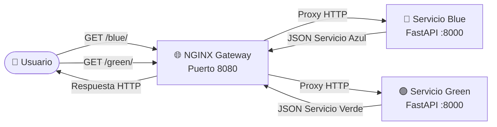
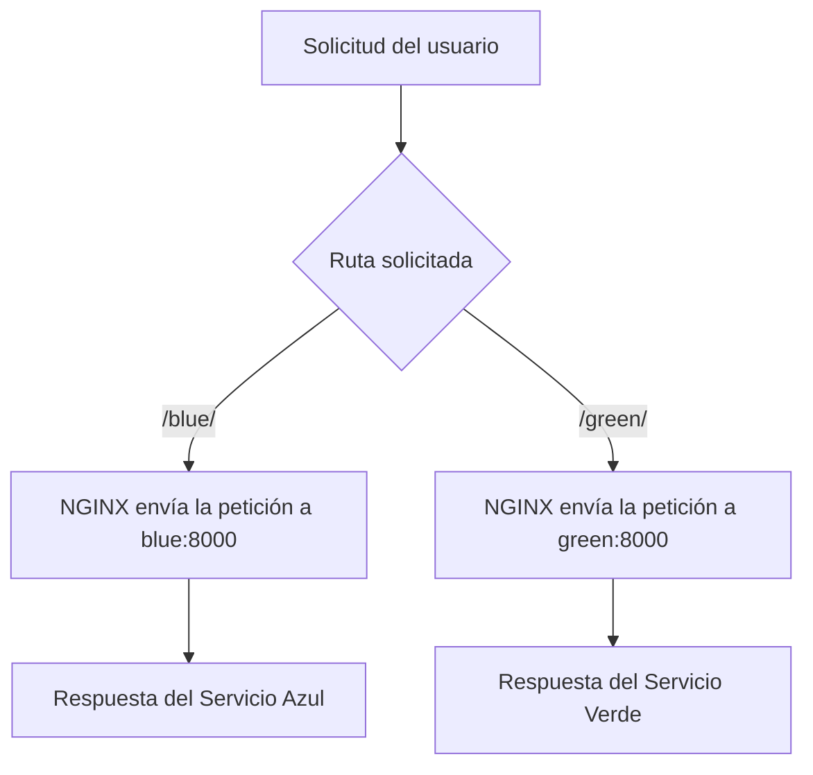
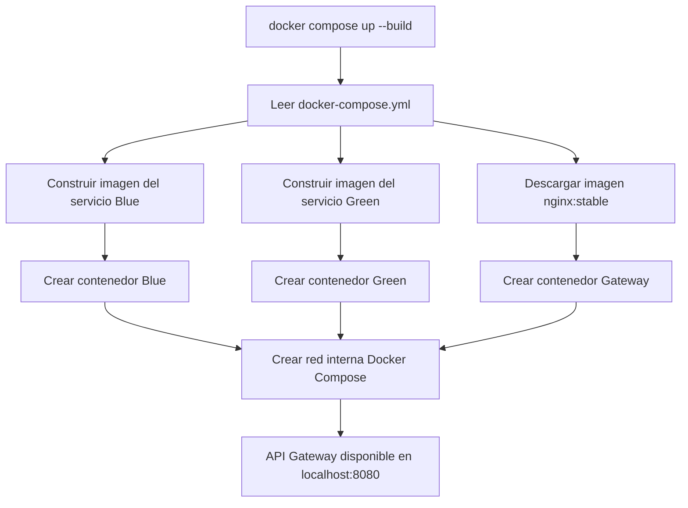
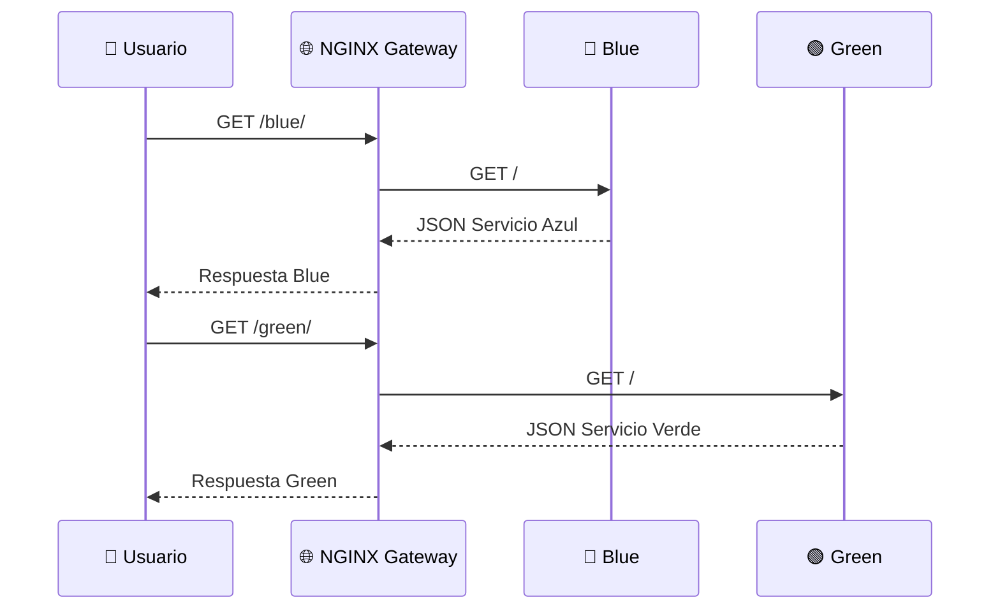
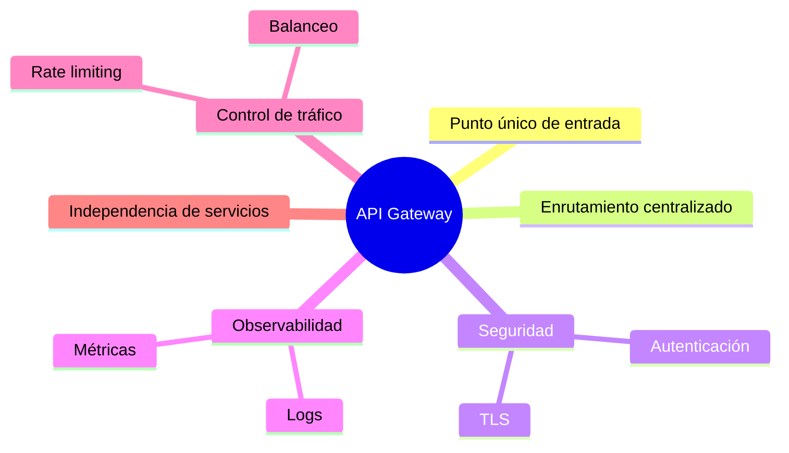

# 🌐 Laboratorio: API Gateway con NGINX y Docker Compose


---

# 📖 Descripción

En este laboratorio se implementará un **API Gateway simple con NGINX**, el cual actuará como punto único de entrada para enrutar solicitudes hacia dos microservicios independientes:

- 🔵 `blue`
- 🟢 `green`

El objetivo es comprender cómo un gateway puede centralizar el acceso a varios servicios, simplificar la comunicación y preparar la arquitectura para escenarios más avanzados de microservicios.

---

# 🎯 Objetivos

Al finalizar este laboratorio el estudiante será capaz de:

- 🌐 Implementar un API Gateway básico con NGINX.
- 🐳 Desplegar múltiples microservicios con Docker Compose.
- 🔵 Crear un servicio `blue` usando FastAPI.
- 🟢 Crear un servicio `green` usando FastAPI.
- 🔀 Configurar reglas de enrutamiento en NGINX.
- 📜 Analizar logs para verificar el comportamiento del gateway.
- 🧠 Comprender el rol del API Gateway en arquitecturas de microservicios.

---

# 🏗️ Arquitectura del laboratorio



---

# 📁 Estructura del proyecto

```text
📁 micro2
├── 📁 blue
│   ├── 📄 app.py
│   ├── 📄 Dockerfile
│   └── 📄 requirements.txt
│
├── 📁 green
│   ├── 📄 app.py
│   ├── 📄 Dockerfile
│   └── 📄 requirements.txt
│
├── 📁 gateway
│   └── 📄 nginx.conf
│
└── 📄 docker-compose.yml
```

---

# 🔵 Paso 1. Crear el microservicio Blue

Archivo:

```text
blue/app.py
```

```python
from fastapi import FastAPI

app = FastAPI()

@app.get("/")
def home():
    return {
        "color": "blue",
        "msg": "Servicio azul"
    }
```

---

## 📦 Dependencias del servicio Blue

Archivo:

```text
blue/requirements.txt
```

```text
fastapi
uvicorn[standard]
```

---

## 🐳 Dockerfile del servicio Blue

Archivo:

```text
blue/Dockerfile
```

```dockerfile
FROM python:3.11-slim

WORKDIR /app

COPY requirements.txt .

RUN pip install --no-cache-dir -r requirements.txt

COPY . .

EXPOSE 8000

CMD ["uvicorn","app:app","--host","0.0.0.0","--port","8000"]
```

---

# 🟢 Paso 2. Crear el microservicio Green

Archivo:

```text
green/app.py
```

```python
from fastapi import FastAPI

app = FastAPI()

@app.get("/")
def home():
    return {
        "color": "green",
        "msg": "Servicio verde"
    }
```

---

## 📦 Dependencias del servicio Green

Archivo:

```text
green/requirements.txt
```

```text
fastapi
uvicorn[standard]
```

---

## 🐳 Dockerfile del servicio Green

Archivo:

```text
green/Dockerfile
```

```dockerfile
FROM python:3.11-slim

WORKDIR /app

COPY requirements.txt .

RUN pip install --no-cache-dir -r requirements.txt

COPY . .

EXPOSE 8000

CMD ["uvicorn","app:app","--host","0.0.0.0","--port","8000"]
```

---

# 🌐 Paso 3. Configurar NGINX como API Gateway

Archivo:

```text
gateway/nginx.conf
```

```nginx
events { }

http {
    server {
        listen 80;

        location /blue/ {
            proxy_pass http://blue:8000/;
        }

        location /green/ {
            proxy_pass http://green:8000/;
        }
    }
}
```

---

# 🔀 ¿Qué hace esta configuración?



---

# ⚙️ Paso 4. Crear Docker Compose

Archivo:

```text
docker-compose.yml
```

```yaml
services:

  blue:
    build: ./blue
    container_name: service-blue

  green:
    build: ./green
    container_name: service-green

  gateway:
    image: nginx:stable
    container_name: api-gateway
    volumes:
      - ./gateway/nginx.conf:/etc/nginx/nginx.conf:ro
    ports:
      - "8080:80"
    depends_on:
      - blue
      - green
```

---

# 🐳 Flujo de despliegue con Docker Compose



---

# ▶️ Paso 5. Desplegar el laboratorio

Desde la carpeta principal `micro2`, ejecutar:

```bash
docker compose up --build
```

También puede ejecutarse en segundo plano:

```bash
docker compose up --build -d
```

---

# 🔍 Paso 6. Verificar los contenedores

```bash
docker compose ps
```

Resultado esperado:

```text
NAME            STATUS

service-blue    Up

service-green   Up

api-gateway     Up
```

---

# 🌍 Paso 7. Probar el API Gateway

## 🔵 Probar servicio Blue

Abrir en el navegador:

```text
http://localhost:8080/blue/
```

O ejecutar:

```bash
curl http://localhost:8080/blue/
```

Respuesta esperada:

```json
{
    "color": "blue",
    "msg": "Servicio azul"
}
```

---

## 🟢 Probar servicio Green

Abrir en el navegador:

```text
http://localhost:8080/green/
```

O ejecutar:

```bash
curl http://localhost:8080/green/
```

Respuesta esperada:

```json
{
    "color": "green",
    "msg": "Servicio verde"
}
```

---

# 📡 Comunicación entre componentes



---

# 📜 Paso 8. Visualizar logs

Ver logs de todos los servicios:

```bash
docker compose logs
```

Ver logs en tiempo real:

```bash
docker compose logs -f
```

Ver únicamente los logs del gateway:

```bash
docker compose logs -f gateway
```

---

# 🧪 Paso 9. Simular una falla

Detener el servicio `blue`:

```bash
docker stop service-blue
```

Intentar acceder nuevamente:

```bash
curl http://localhost:8080/blue/
```

NGINX no podrá enrutar correctamente hacia el servicio `blue`.

Luego probar el servicio `green`:

```bash
curl http://localhost:8080/green/
```

El servicio `green` seguirá funcionando.

---

# 🔄 Paso 10. Recuperar el servicio

```bash
docker start service-blue
```

Probar nuevamente:

```bash
curl http://localhost:8080/blue/
```

---

# 🧹 Paso 11. Finalizar el laboratorio

```bash
docker compose down
```

---

# 🧠 Conceptos DevOps aplicados

| Concepto | Aplicación |
|---|---|
| 🌐 API Gateway | NGINX centraliza el acceso a los microservicios. |
| 🐳 Docker | Cada servicio se ejecuta dentro de su propio contenedor. |
| ⚙️ Docker Compose | Automatiza el despliegue multicontenedor. |
| 🔀 Enrutamiento | NGINX dirige `/blue/` y `/green/` a servicios diferentes. |
| 📦 Imagen Docker | Cada microservicio se construye desde su propio Dockerfile. |
| 📜 Logs | Permiten observar el comportamiento del gateway y los servicios. |
| 🧩 Microservicios | Cada componente tiene una responsabilidad específica. |

---

# 💡 Buenas prácticas observadas

- ✅ Usar un gateway como punto único de entrada.
- ✅ Separar responsabilidades entre servicios.
- ✅ No exponer directamente todos los microservicios al usuario final.
- ✅ Utilizar nombres de servicio de Docker Compose para comunicación interna.
- ✅ Mantener la configuración de NGINX en un archivo externo.
- ✅ Montar la configuración del gateway en modo solo lectura `:ro`.

---

# 🚀 Ventajas de usar API Gateway



---

# 🧪 Actividades propuestas

Realice las siguientes actividades:

- ✅ Cambie el mensaje del servicio `blue`.
- ✅ Cambie el mensaje del servicio `green`.
- ✅ Agregue una nueva ruta `/status` en ambos servicios.
- ✅ Agregue un tercer servicio llamado `red`.
- ✅ Configure una nueva ruta `/red/` en NGINX.
- ✅ Visualice los logs del gateway al consultar cada ruta.
- ✅ Ejecute el laboratorio en modo segundo plano con `docker compose up -d`.

---

# ❓ Preguntas de reflexión

1. ¿Qué función cumple NGINX dentro de esta arquitectura?
2. ¿Por qué el usuario accede únicamente al puerto `8080`?
3. ¿Qué ventaja ofrece enrutar `/blue/` y `/green/` desde un solo punto?
4. ¿Qué ocurriría si se detiene uno de los servicios?
5. ¿Cómo podría ampliarse este laboratorio para incluir balanceo de carga?
6. ¿Qué diferencia existe entre un API Gateway y un balanceador de carga?

---

# 🎯 Conclusiones

En este laboratorio se implementó una arquitectura básica de microservicios utilizando **Docker Compose**, **FastAPI** y **NGINX** como **API Gateway**.

El gateway permitió centralizar el acceso a los servicios `blue` y `green`, demostrando cómo una aplicación puede organizarse en componentes independientes sin exponer directamente cada microservicio al usuario final.

Este enfoque representa una práctica común en arquitecturas modernas orientadas a microservicios y constituye una base importante para avanzar hacia plataformas más robustas como Kubernetes, Ingress Controllers, Service Mesh y despliegues cloud-native.

---

<div align="center">

## 🚀 Curso de Profesionalización en DevOps

**Docker • Docker Compose • NGINX • API Gateway • Microservicios**

</div>
