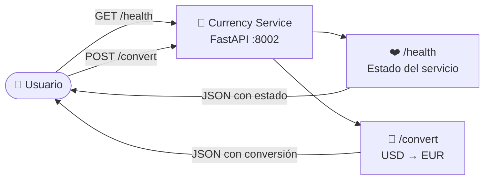
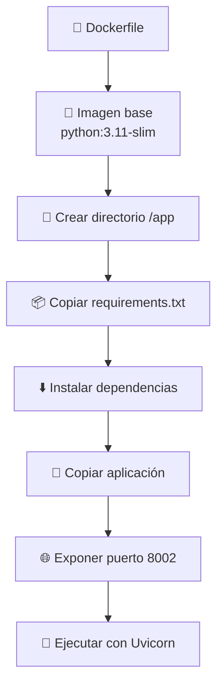
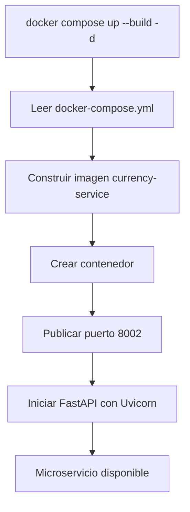
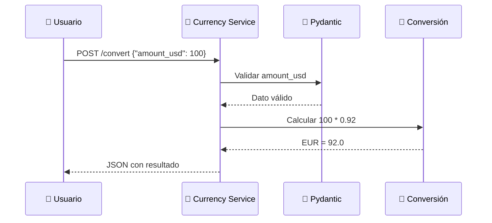
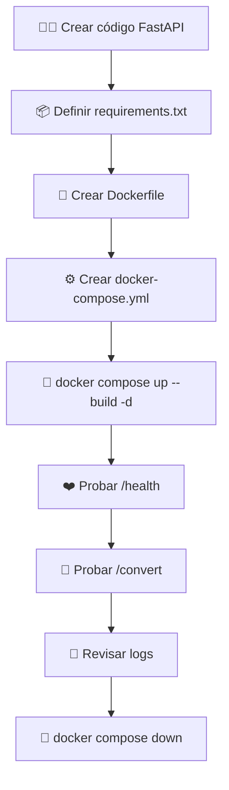

# 💱 Laboratorio: Microservicio de Conversión de Monedas con Docker


---

## 📖 Descripción

En este laboratorio se construirá un **microservicio de conversión de monedas** utilizando **FastAPI**, **Docker** y **Docker Compose**.

El servicio permitirá convertir un valor en dólares estadounidenses (**USD**) a euros (**EUR**) mediante una tasa fija de ejemplo. Además, incluirá una ruta `/health` para verificar el estado del servicio, siguiendo buenas prácticas básicas de aplicaciones en contenedores. El documento base define este microservicio con las rutas `/health` y `/convert`, usando **Pydantic** para validar la entrada JSON y exponiendo el servicio en el puerto `8002`. :contentReference[oaicite:0]{index=0}

---

## 🎯 Objetivos

Al finalizar este laboratorio, el estudiante será capaz de:

- 💱 Crear un microservicio básico de conversión de monedas.
- ⚡ Implementar endpoints REST con FastAPI.
- 🧾 Validar datos de entrada mediante Pydantic.
- 🐳 Construir una imagen Docker personalizada.
- ⚙️ Desplegar el servicio usando Docker Compose.
- ❤️ Verificar el estado del servicio mediante un endpoint `/health`.
- 📜 Analizar logs básicos del contenedor.

---

# 🏗️ Arquitectura del laboratorio



---

# 📁 Estructura del proyecto

```text
📁 currency-service
├── 📄 app.py
├── 📄 requirements.txt
├── 📄 Dockerfile
└── 📄 docker-compose.yml
```

---

# ⚡ Paso 1. Crear el microservicio

Archivo:

```text
app.py
```

```python
from fastapi import FastAPI
from pydantic import BaseModel

app = FastAPI()

# Modelo de entrada
class ConversionRequest(BaseModel):
    amount_usd: float

# Tasa de cambio estática para el laboratorio
USD_TO_EUR = 0.92

@app.get("/health")
def health():
    return {
        "status": "ok",
        "service": "currency-service"
    }

@app.post("/convert")
def convert(data: ConversionRequest):
    eur = data.amount_usd * USD_TO_EUR

    return {
        "usd": data.amount_usd,
        "eur": round(eur, 2),
        "rate": USD_TO_EUR
    }
```

## 🔍 Descripción del proceso

Este archivo contiene la lógica principal del microservicio:

- `/health` verifica que el servicio esté disponible.
- `/convert` recibe un valor en USD y devuelve su equivalente en EUR.
- `ConversionRequest` valida que el dato recibido sea numérico.
- `USD_TO_EUR` representa una tasa fija de conversión para fines educativos.

---

# 📦 Paso 2. Crear el archivo de dependencias

Archivo:

```text
requirements.txt
```

```text
fastapi
uvicorn[standard]
pydantic
```

## 🔍 Descripción del proceso

Este archivo indica las librerías que necesita el microservicio:

| Dependencia | Función |
|---|---|
| `fastapi` | Framework para crear la API REST. |
| `uvicorn[standard]` | Servidor ASGI para ejecutar FastAPI. |
| `pydantic` | Validación de datos de entrada. |

El documento base también define estas dependencias para el microservicio de conversión. :contentReference[oaicite:1]{index=1}

---

# 🐳 Paso 3. Crear el Dockerfile

Archivo:

```text
Dockerfile
```

```dockerfile
FROM python:3.11-slim

WORKDIR /app

COPY requirements.txt .

RUN pip install --no-cache-dir -r requirements.txt

COPY . .

EXPOSE 8002

CMD ["uvicorn", "app:app", "--host", "0.0.0.0", "--port", "8002"]
```

## 🔍 Descripción del proceso

El `Dockerfile` define cómo se construye la imagen del microservicio:



---

# ⚙️ Paso 4. Crear Docker Compose

Archivo:

```text
docker-compose.yml
```

```yaml
services:

  currency-service:

    build: .

    container_name: currency-service

    ports:
      - "8002:8002"

    restart: always
```

## 🔍 Descripción del proceso

Docker Compose permite automatizar el despliegue del microservicio. En lugar de ejecutar varios comandos manuales, el archivo `docker-compose.yml` define:

- La construcción de la imagen.
- El nombre del contenedor.
- El puerto publicado.
- La política de reinicio del servicio.

---

# 🚀 Paso 5. Desplegar el microservicio

Ejecutar:

```bash
docker compose up --build -d
```

## 🔍 ¿Qué ocurre internamente?



---

# 🔍 Paso 6. Verificar el contenedor

```bash
docker compose ps
```

Resultado esperado:

```text
NAME               STATUS

currency-service   Up
```

---

# ❤️ Paso 7. Probar el endpoint de salud

Abrir en el navegador:

```text
http://localhost:8002/health
```

O ejecutar:

```bash
curl http://localhost:8002/health
```

Respuesta esperada:

```json
{
    "status": "ok",
    "service": "currency-service"
}
```

## 🔍 Descripción del proceso

El endpoint `/health` permite comprobar si el servicio está activo. Esta práctica es fundamental en entornos DevOps porque facilita la validación automática del estado de una aplicación.

---

# 💱 Paso 8. Probar la conversión de monedas

Ejecutar:

```bash
curl -X POST http://localhost:8002/convert \
-H "Content-Type: application/json" \
-d '{"amount_usd": 100}'
```

Respuesta esperada:

```json
{
    "usd": 100,
    "eur": 92.0,
    "rate": 0.92
}
```

## 🔍 Descripción del proceso

El cliente envía un valor en dólares mediante JSON. El microservicio recibe el dato, valida la entrada con Pydantic, aplica la tasa de conversión y devuelve una respuesta estructurada.

---

# 📡 Flujo de petición y respuesta



---

# 📜 Paso 9. Visualizar logs

Ver logs del servicio:

```bash
docker compose logs
```

Ver logs en tiempo real:

```bash
docker compose logs -f
```

## 🔍 Descripción del proceso

Los logs permiten observar las solicitudes HTTP recibidas por el microservicio. En entornos reales, los logs son esenciales para depuración, monitoreo y análisis de incidentes.

---

# 🧪 Paso 10. Probar validación de datos

Enviar un valor incorrecto:

```bash
curl -X POST http://localhost:8002/convert \
-H "Content-Type: application/json" \
-d '{"amount_usd": "texto"}'
```

FastAPI y Pydantic devolverán un error de validación.

## 🔍 Descripción del proceso

Esta prueba demuestra que el microservicio no acepta cualquier dato. El modelo `ConversionRequest` exige que `amount_usd` sea un número.

---

# 🧹 Paso 11. Finalizar el laboratorio

```bash
docker compose down
```

---

# 🧠 Conceptos DevOps aplicados

| Concepto | Aplicación |
|---|---|
| 🐳 Contenedor | El microservicio se ejecuta de forma aislada. |
| 📦 Imagen Docker | La aplicación se empaqueta con sus dependencias. |
| ⚙️ Docker Compose | Automatiza la construcción y ejecución del servicio. |
| ❤️ Health endpoint | Permite validar si el servicio está operativo. |
| 🧾 Validación | Pydantic controla la calidad de los datos de entrada. |
| 📜 Logs | Facilitan la observación y depuración del servicio. |
| 🌐 API REST | El servicio expone endpoints HTTP reutilizables. |

---

# 💡 Buenas prácticas observadas

- ✅ Usar una imagen ligera como `python:3.11-slim`.
- ✅ Definir dependencias en `requirements.txt`.
- ✅ Exponer el servicio en un puerto específico.
- ✅ Incluir un endpoint `/health`.
- ✅ Validar entradas con Pydantic.
- ✅ Ejecutar la aplicación escuchando en `0.0.0.0`.
- ✅ Mantener el servicio como una unidad pequeña y especializada.

---

# 🚀 Flujo completo del laboratorio



---

# 🧪 Actividades propuestas

Realice las siguientes actividades:

- ✅ Cambie la tasa de conversión de `0.92` a otro valor.
- ✅ Agregue una nueva conversión de USD a GBP.
- ✅ Cree un endpoint `/rates` para mostrar las tasas disponibles.
- ✅ Agregue un campo adicional en la respuesta JSON.
- ✅ Ejecute el servicio usando únicamente `docker build` y `docker run`.
- ✅ Compare el despliegue manual con el despliegue usando Docker Compose.

---

# ❓ Preguntas de reflexión

1. ¿Qué función cumple Pydantic en este microservicio?
2. ¿Por qué es importante tener un endpoint `/health`?
3. ¿Qué ventaja ofrece Docker Compose frente a `docker run`?
4. ¿Por qué el contenedor debe escuchar en `0.0.0.0`?
5. ¿Qué ocurriría si se cambia el puerto `8002` en el Dockerfile pero no en Docker Compose?
6. ¿Cómo podría integrarse este microservicio dentro de un pipeline DevOps?

---

# 🎯 Conclusiones

En este laboratorio se implementó un microservicio sencillo pero representativo de un entorno real. La aplicación permitió convertir valores de USD a EUR mediante una API REST, validar datos de entrada con Pydantic, empaquetar el servicio en una imagen Docker y desplegarlo mediante Docker Compose.

Este ejercicio permite comprender cómo los microservicios pequeños, especializados y portables constituyen una base importante para arquitecturas modernas orientadas a DevOps y despliegues automatizados.

---

<div align="center">

## 🚀 Curso de Profesionalización en DevOps

**Docker • Docker Compose • FastAPI • Microservicios • APIs REST**

</div>
