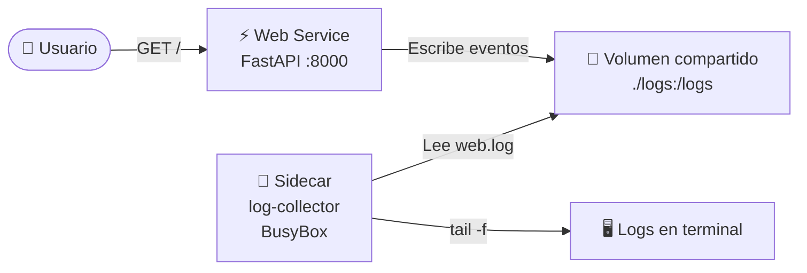
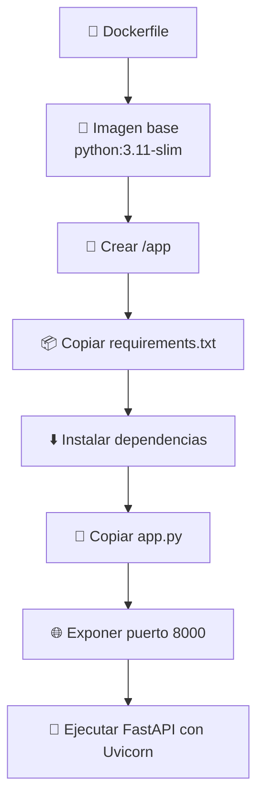
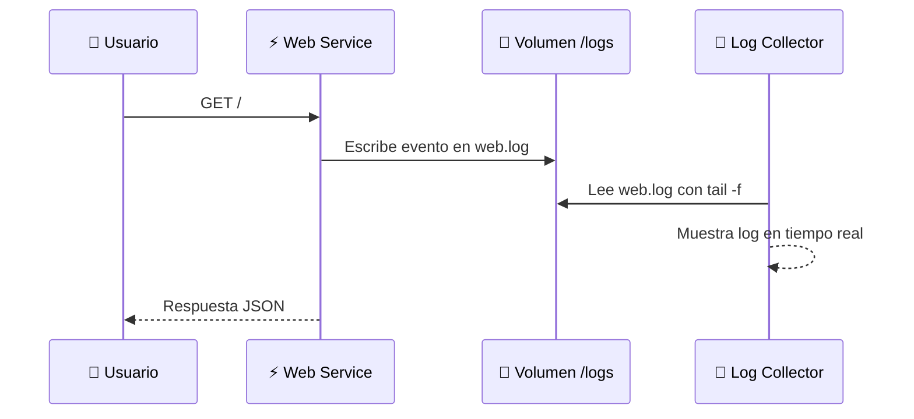
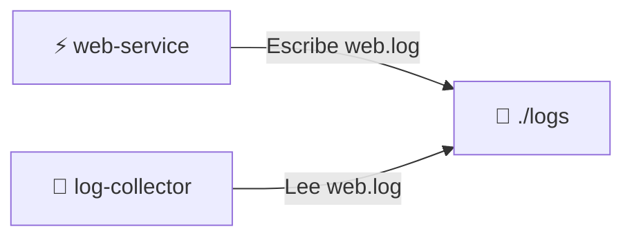
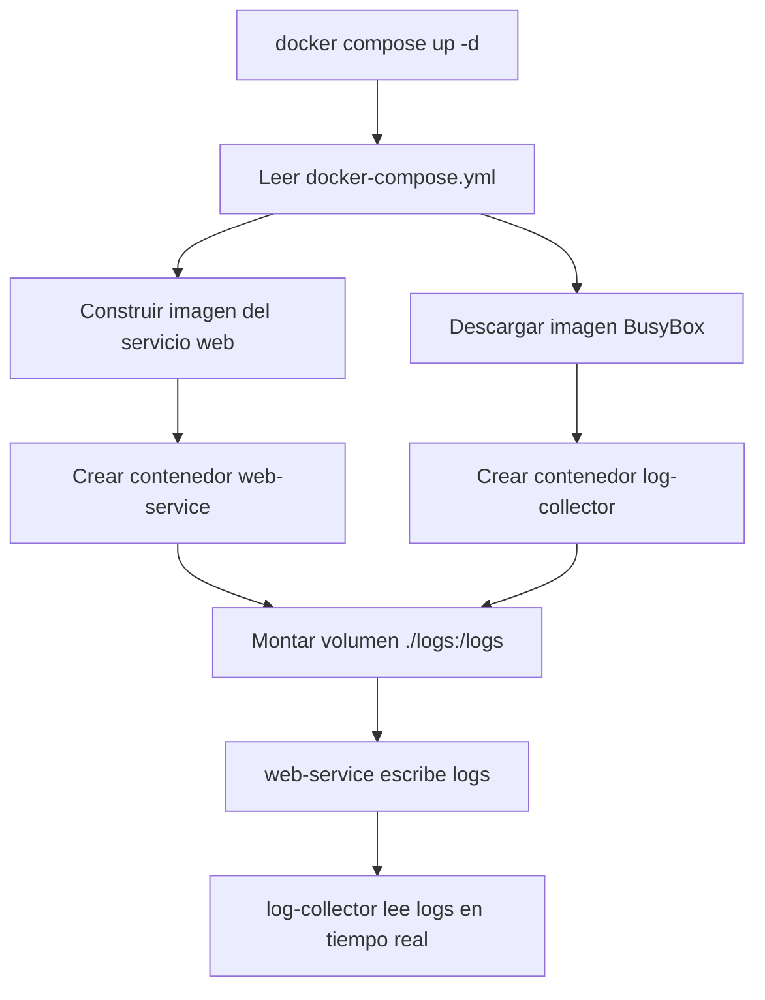
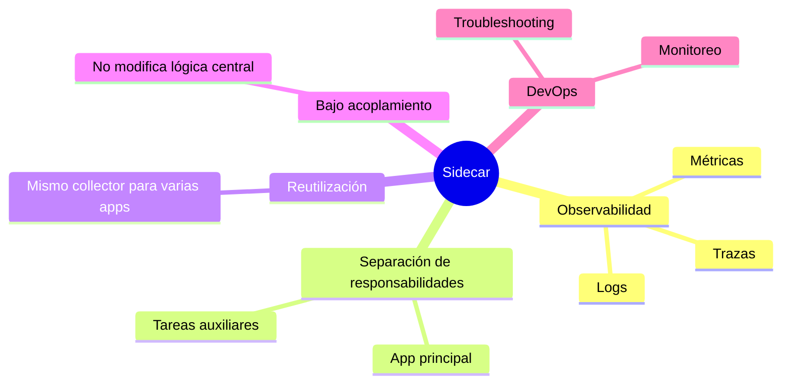

# 📜 Laboratorio: Microservicio Sidecar para Recolección de Logs


---

# 📖 Descripción

En este laboratorio se implementará el patrón **Sidecar** para recolectar logs generados por un microservicio web.

El servicio principal estará desarrollado con **FastAPI** y escribirá sus registros en un archivo compartido. Un segundo contenedor, llamado **log-collector**, leerá ese archivo en tiempo real usando `tail -f`.

Este ejemplo está basado en el **Ejemplo 4: Microservicio sidecar para recolección de logs** del documento `Docker_Unidad_5.pdf`, donde se define un servicio `web`, un volumen compartido `./logs:/logs` y un contenedor `log-collector` basado en BusyBox. :contentReference[oaicite:0]{index=0} :contentReference[oaicite:1]{index=1}

---

# 🎯 Objetivos

Al finalizar este laboratorio, el estudiante será capaz de:

- 📜 Comprender el patrón **Sidecar** aplicado a logs.
- 🐳 Desplegar múltiples contenedores con Docker Compose.
- ⚡ Implementar un microservicio web con FastAPI.
- 📁 Compartir archivos entre contenedores mediante volúmenes.
- 🔎 Recolectar logs en tiempo real desde un contenedor auxiliar.
- 🧠 Relacionar el patrón Sidecar con prácticas de observabilidad en DevOps.

---

# 🧩 ¿Qué es el patrón Sidecar?

El patrón **Sidecar** consiste en ejecutar un contenedor auxiliar junto a un contenedor principal para agregar funcionalidades complementarias sin modificar directamente la lógica central de la aplicación.

En este laboratorio:

| Componente | Función |
|---|---|
| ⚡ `web` | Ejecuta la API principal y genera logs. |
| 📜 `log-collector` | Lee los logs generados por el servicio web. |
| 📁 `logs` | Carpeta compartida entre ambos contenedores. |

---

# 🏗️ Arquitectura del laboratorio



---

# 📁 Estructura del proyecto

```text
📁 micro4
├── 📁 web
│   ├── 📄 app.py
│   ├── 📄 requirements.txt
│   └── 📄 Dockerfile
│
├── 📁 logs
│   └── 📄 web.log
│
└── 📄 docker-compose.yml
```

> 💡 La carpeta `logs` se creará manualmente antes de levantar los servicios.

---

# ⚡ Paso 1. Crear el microservicio web

Archivo:

```text
web/app.py
```

```python
from fastapi import FastAPI
import logging
import os

# Crear directorio de logs si no existe
os.makedirs("/logs", exist_ok=True)

# Configurar archivo de logs
logging.basicConfig(
    filename="/logs/web.log",
    level=logging.INFO,
    format="%(asctime)s - %(levelname)s - %(message)s"
)

app = FastAPI()

@app.get("/")
def home():
    logging.info("Solicitud recibida en la ruta principal /")

    return {
        "service": "web",
        "message": "Microservicio web funcionando correctamente"
    }

@app.get("/health")
def health():
    logging.info("Verificación de salud ejecutada en /health")

    return {
        "status": "ok",
        "service": "web"
    }
```

## 🔍 Descripción del proceso

Este archivo contiene la lógica principal de la aplicación:

- Crea el directorio `/logs` dentro del contenedor.
- Configura Python `logging` para escribir en `/logs/web.log`.
- Expone la ruta `/` para probar el servicio.
- Expone la ruta `/health` para verificar el estado del servicio.
- Registra eventos cada vez que se recibe una solicitud.

---

# 📦 Paso 2. Crear el archivo de dependencias

Archivo:

```text
web/requirements.txt
```

```text
fastapi
uvicorn[standard]
```

## 🔍 Descripción del proceso

Este archivo define las librerías necesarias para ejecutar el microservicio:

| Dependencia | Función |
|---|---|
| `fastapi` | Framework para crear la API REST. |
| `uvicorn[standard]` | Servidor ASGI para ejecutar FastAPI. |

El documento base también define estas dependencias para el servicio `web`. :contentReference[oaicite:2]{index=2}

---

# 🐳 Paso 3. Crear el Dockerfile del servicio web

Archivo:

```text
web/Dockerfile
```

```dockerfile
FROM python:3.11-slim

WORKDIR /app

COPY requirements.txt .

RUN pip install --no-cache-dir -r requirements.txt

COPY . .

EXPOSE 8000

CMD ["uvicorn","app:app","--host","0.0.0.0","--port","8000"]
```

## 🔍 Descripción del proceso

El `Dockerfile` permite construir una imagen personalizada para el microservicio web.



---

# ⚙️ Paso 4. Crear Docker Compose

Archivo:

```text
docker-compose.yml
```

```yaml
services:

  web:
    build: ./web
    container_name: web-service
    ports:
      - "8000:8000"
    volumes:
      - ./logs:/logs

  log-collector:
    image: busybox
    container_name: log-collector
    command: sh -c "touch /logs/web.log && tail -f /logs/web.log"
    volumes:
      - ./logs:/logs
    depends_on:
      - web
```

## 🔍 Descripción del proceso

Este archivo define dos contenedores:

- `web`: ejecuta el microservicio FastAPI.
- `log-collector`: actúa como sidecar y lee el archivo `/logs/web.log`.

Ambos contenedores comparten el mismo volumen:

```text
./logs:/logs
```

Esto permite que el contenedor `web` escriba logs y que el contenedor `log-collector` los lea en tiempo real.

---

# 🔄 Flujo de funcionamiento del Sidecar



---

# 📁 Paso 5. Crear carpeta de logs

Antes de levantar los servicios, crear la carpeta:

```bash
mkdir -p logs
```

## 🔍 Descripción del proceso

Esta carpeta funcionará como almacenamiento compartido entre el contenedor principal y el sidecar.



---

# 🚀 Paso 6. Levantar los servicios

Ejecutar:

```bash
docker compose up -d
```

## 🔍 ¿Qué ocurre internamente?



---

# 🔍 Paso 7. Verificar contenedores

```bash
docker compose ps
```

Resultado esperado:

```text
NAME             STATUS

web-service      Up

log-collector    Up
```

---

# 🌐 Paso 8. Probar la API

Abrir en el navegador:

```text
http://localhost:8000/
```

O ejecutar:

```bash
curl http://localhost:8000/
```

Respuesta esperada:

```json
{
    "service": "web",
    "message": "Microservicio web funcionando correctamente"
}
```

---

# ❤️ Paso 9. Probar el endpoint de salud

```bash
curl http://localhost:8000/health
```

Respuesta esperada:

```json
{
    "status": "ok",
    "service": "web"
}
```

---

# 📜 Paso 10. Ver logs en tiempo real

Ejecutar:

```bash
docker compose logs -f log-collector
```

Resultado esperado:

```text
2026-07-03 10:00:01 - INFO - Solicitud recibida en la ruta principal /
2026-07-03 10:00:10 - INFO - Verificación de salud ejecutada en /health
```

## 🔍 Descripción del proceso

Cada vez que el usuario accede a la API, el servicio `web` escribe una línea en el archivo `web.log`.

El contenedor `log-collector` lee ese archivo en tiempo real mediante:

```bash
tail -f /logs/web.log
```

---

# 🧪 Paso 11. Generar actividad sobre la API

Ejecutar varias solicitudes:

```bash
curl http://localhost:8000/
curl http://localhost:8000/health
curl http://localhost:8000/
```

Luego observar nuevamente:

```bash
docker compose logs -f log-collector
```

---

# 🧠 Conceptos DevOps aplicados

| Concepto | Aplicación |
|---|---|
| 📜 Sidecar | Contenedor auxiliar que recolecta logs. |
| 🐳 Docker Compose | Orquesta el servicio principal y el sidecar. |
| 📁 Volumen compartido | Permite intercambiar logs entre contenedores. |
| ⚡ FastAPI | Expone la API principal. |
| 🧰 BusyBox | Ejecuta una tarea liviana de lectura de logs. |
| 🔎 Observabilidad | Facilita el seguimiento de eventos de la aplicación. |
| ❤️ Health endpoint | Permite verificar la disponibilidad del servicio. |

---

# 💡 Buenas prácticas observadas

- ✅ Separar la lógica de negocio de la recolección de logs.
- ✅ Usar un contenedor auxiliar para tareas complementarias.
- ✅ Compartir archivos mediante volúmenes.
- ✅ Mantener el servicio principal liviano.
- ✅ Exponer logs para depuración y monitoreo.
- ✅ Agregar una ruta `/health` para verificación operativa.

---

# 🧩 ¿Por qué usar un Sidecar?



---

# 🧪 Actividades propuestas

Realice las siguientes actividades:

- ✅ Cambie el mensaje devuelto por la ruta `/`.
- ✅ Agregue una nueva ruta `/status`.
- ✅ Genere logs cuando se consulte `/status`.
- ✅ Cambie el formato del log agregando el nombre del servicio.
- ✅ Detenga el contenedor `log-collector` y verifique si la aplicación sigue funcionando.
- ✅ Reinicie el sidecar y compruebe si vuelve a leer el archivo `web.log`.
- ✅ Revise directamente el archivo generado en la carpeta local `logs`.

---

# ❓ Preguntas de reflexión

1. ¿Cuál es la función del contenedor `log-collector`?
2. ¿Por qué se utiliza un volumen compartido?
3. ¿Qué ventaja ofrece separar la recolección de logs de la aplicación principal?
4. ¿Qué ocurriría si el contenedor sidecar falla?
5. ¿La aplicación web depende directamente del sidecar para responder solicitudes?
6. ¿Cómo podría evolucionar este ejemplo hacia una solución con Promtail, Fluent Bit o Filebeat?

---

# 🧹 Paso 12. Finalizar el laboratorio

```bash
docker compose down
```

Para eliminar también los logs generados:

```bash
rm -rf logs
```

---

# 🎯 Conclusiones

En este laboratorio se implementó el patrón **Sidecar** para recolectar logs generados por un microservicio web. El contenedor principal ejecutó una API con FastAPI, mientras que el contenedor auxiliar `log-collector` se encargó de leer los registros en tiempo real desde un volumen compartido.

Este enfoque permite separar responsabilidades, mejorar la observabilidad y preparar a los estudiantes para comprender herramientas más avanzadas de monitoreo y logging utilizadas en entornos DevOps y cloud-native.

---

<div align="center">

## 🚀 Curso de Profesionalización en DevOps

**Docker • Docker Compose • FastAPI • Sidecar • Logs • Observabilidad**

</div>
