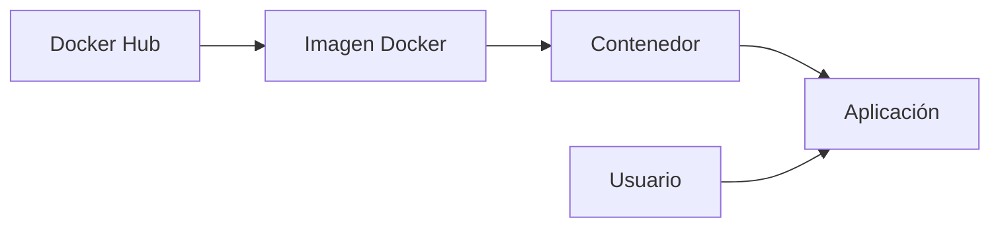

<div align="center">

# 🐳 Laboratorios de Docker
### *Uso de Contenedores para Entornos de Desarrollo y DevOps*


</div>

---

# 📖 Descripción

Bienvenido a este repositorio.

Este repositorio reúne una colección de **laboratorios prácticos sobre Docker**, orientados al aprendizaje del uso de **contenedores** dentro de un entorno **DevOps**. El contenido está diseñado para proporcionar una experiencia práctica en la creación, administración y operación de contenedores, siguiendo buenas prácticas utilizadas en entornos profesionales.

Cada laboratorio presenta actividades guiadas que permiten comprender el ciclo de vida de un contenedor, desde la ejecución de imágenes hasta la administración de recursos y la implementación de aplicaciones.

---

# 🎯 Objetivos

Al finalizar los laboratorios serás capaz de:

- 🐳 Comprender la arquitectura básica de Docker.
- 📦 Crear y administrar contenedores.
- 🖼️ Trabajar con imágenes oficiales de Docker Hub.
- ⚙️ Ejecutar aplicaciones en contenedores.
- 🌐 Publicar servicios mediante el mapeo de puertos.
- 💾 Gestionar volúmenes para persistencia de datos.
- 🔗 Configurar redes entre contenedores.
- ❤️ Implementar verificaciones mediante **Healthcheck**.
- 🧹 Administrar imágenes, contenedores y recursos del motor Docker.
- 🚀 Aplicar buenas prácticas para el desarrollo y despliegue de aplicaciones contenerizadas.

---

# 📚 Contenido del repositorio

Los laboratorios abordan temas como:

- 🚀 Creación y ejecución de contenedores.
- 📦 Gestión de imágenes Docker.
- 🖥️ Ejecución interactiva y en segundo plano.
- 🔍 Inspección de contenedores.
- 💻 Acceso a contenedores mediante `docker exec`.
- ❤️ Configuración de **Healthcheck**.
- 💾 Uso de volúmenes.
- 🌐 Configuración de redes Docker.
- 🧹 Limpieza de imágenes, contenedores y volúmenes.
- 📈 Buenas prácticas para proyectos DevOps.

---

# 🏗️ Arquitectura general



---

# 📂 Organización del repositorio

```text
📦 Docker-Labs
│
├── 📁 Fundamentos
└── 📄 README.md
```

Cada laboratorio está diseñado para desarrollar progresivamente las competencias necesarias para trabajar con Docker en proyectos de desarrollo y automatización.

---

# 💡 Competencias que desarrollarás

Durante el desarrollo de los laboratorios pondrás en práctica habilidades relacionadas con:

| Competencia | Descripción |
|-------------|-------------|
| 🐳 Contenedorización | Ejecución y administración de aplicaciones mediante contenedores Docker. |
| 📦 Gestión de imágenes | Descarga, creación y eliminación de imágenes. |
| 🔐 Aislamiento | Comprensión del aislamiento entre aplicaciones y el sistema anfitrión. |
| 🌐 Redes | Comunicación entre contenedores mediante redes Docker. |
| 💾 Persistencia | Uso de volúmenes para almacenar información. |
| ❤️ Monitoreo | Implementación de verificaciones de estado mediante Healthcheck. |
| 🚀 DevOps | Integración de Docker dentro de flujos modernos de desarrollo y despliegue. |

---

# 🌟 Buenas prácticas

> [!TIP]
>
> Para aprovechar al máximo los laboratorios se recomienda:
>
> - Ejecutar cada ejercicio en el orden propuesto.
> - Analizar el resultado de cada comando antes de continuar.
> - Utilizar nombres descriptivos para imágenes y contenedores.
> - Documentar los cambios realizados.
> - Eliminar los recursos que ya no se utilicen para mantener un entorno limpio.

---

# 🛠️ Tecnologías utilizadas

- 🐳 Docker Engine
- 📦 Docker Hub
- 🐧 Linux
- 💻 Terminal Bash
- ⚙️ Docker CLI

---

# 🎓 Público objetivo

Este repositorio está orientado a:

- Estudiantes de DevOps.
- Profesionales de TI.
- Administradores de sistemas.
- Desarrolladores de software.
- Personas interesadas en la contenerización de aplicaciones.

---

# 📌 Requisitos

Antes de iniciar los laboratorios es recomendable contar con:

- Docker Engine instalado.
- Acceso a una terminal Linux o PowerShell.
- Conocimientos básicos de línea de comandos.
- Conexión a Internet para descargar imágenes desde Docker Hub.

---

# 🚀 Resultado esperado

Al completar todos los laboratorios el participante habrá adquirido los conocimientos necesarios para trabajar con contenedores Docker en escenarios reales, comprendiendo su funcionamiento, administración y aplicación dentro de un flujo de trabajo DevOps.

---

<div align="center">

### 🐳 Docker • 📦 Contenedores • 🚀 DevOps

**Material académico para prácticas de formación profesional**

</div>
