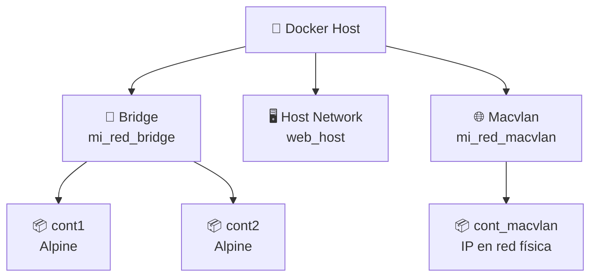
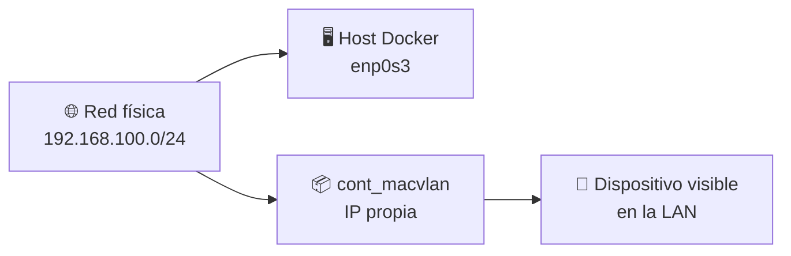

# 🌐 Laboratorio: Redes Docker Bridge, Host y Macvlan

> [!NOTE]
> **Curso:** Prácticas de DevOps utilizando Docker y GitFlow  
> **Unidad:** Redes en Docker  
> **Tema:** Administración básica de redes Docker  
> **Duración estimada:** 60 minutos  
> **Nivel:** Intermedio

---

# 🎯 Objetivos de aprendizaje

Al finalizar este laboratorio será capaz de:

- ✅ Crear una red **bridge** personalizada.
- ✅ Conectar contenedores a una red Docker definida por el usuario.
- ✅ Validar conectividad entre contenedores mediante nombres DNS internos.
- ✅ Comprender el funcionamiento de la red **host**.
- ✅ Identificar el uso de redes **macvlan** para integrar contenedores a una red física.
- ✅ Eliminar redes Docker creadas durante el laboratorio.

---

# 📖 Introducción

Docker permite crear diferentes tipos de redes para conectar contenedores entre sí, con el sistema anfitrión o incluso con la red física. La correcta selección del tipo de red es fundamental en escenarios DevOps, especialmente cuando se despliegan aplicaciones distribuidas, servicios web, bases de datos, balanceadores de carga o entornos de prueba.

En este laboratorio se trabajará con tres tipos de redes:

| Tipo de red | Descripción general |
|------------|---------------------|
| 🌉 **Bridge** | Red virtual privada para comunicar contenedores dentro del mismo host. |
| 🖥️ **Host** | El contenedor comparte directamente la pila de red del sistema anfitrión. |
| 🌐 **Macvlan** | El contenedor aparece en la red física como un dispositivo independiente. |

---

# 🏗️ Arquitectura general



---

# 📋 Requisitos

Antes de iniciar verifique que dispone de:

- 🐳 Docker Engine instalado.
- 💻 Terminal Linux.
- 🌐 Conectividad de red.
- 📦 Imagen `alpine`.
- 📦 Imagen `nginx`.
- 🔐 Permisos de administrador o usuario agregado al grupo `docker`.

> [!TIP]
> Si una imagen no está disponible localmente, Docker la descargará automáticamente desde Docker Hub.

---

# 🌉 Parte 1. Red Bridge personalizada

Una red **bridge** personalizada permite que varios contenedores se comuniquen entre sí utilizando nombres de contenedor como si fueran nombres DNS internos.

> [!NOTE]
> Las redes bridge personalizadas son muy utilizadas en entornos de desarrollo porque aíslan los contenedores y facilitan la comunicación entre servicios.

---

## ▶️ Paso 1. Crear una red bridge personalizada

```bash
docker network create --driver bridge mi_red_bridge
```

### 🔎 Explicación

| Elemento | Descripción |
|---------|-------------|
| `docker network create` | Crea una nueva red Docker. |
| `--driver bridge` | Define que la red será de tipo bridge. |
| `mi_red_bridge` | Nombre asignado a la red. |

---

## ▶️ Paso 2. Verificar la red creada

```bash
docker network ls
```

Resultado esperado:

```text
NETWORK ID     NAME            DRIVER    SCOPE
xxxxxxxxxxxx   mi_red_bridge   bridge    local
```

---

## ▶️ Paso 3. Crear dos contenedores conectados a la red

```bash
docker run -dit --name cont1 --network mi_red_bridge alpine sh
```

```bash
docker run -dit --name cont2 --network mi_red_bridge alpine sh
```

### 🔎 Explicación rápida

| Parámetro | Descripción |
|----------|-------------|
| `-d` | Ejecuta el contenedor en segundo plano. |
| `-i` | Mantiene la entrada estándar abierta. |
| `-t` | Asigna una terminal al contenedor. |
| `--name` | Asigna un nombre al contenedor. |
| `--network mi_red_bridge` | Conecta el contenedor a la red bridge personalizada. |
| `alpine sh` | Ejecuta Alpine Linux con una shell `sh`. |

---

## ▶️ Paso 4. Instalar herramientas de conectividad

Alpine Linux es una imagen minimalista, por lo que algunas herramientas como `ping` no vienen instaladas por defecto.

```bash
docker exec -it cont1 apk add iputils
```

```bash
docker exec -it cont2 apk add iputils
```

> [!TIP]
> `apk` es el gestor de paquetes utilizado por Alpine Linux.

---

## ▶️ Paso 5. Probar conectividad entre contenedores

Desde `cont1`, haga ping hacia `cont2` utilizando el nombre del contenedor:

```bash
docker exec -it cont1 ping -c 3 cont2
```

Resultado esperado:

```text
PING cont2 (172.x.x.x): 56 data bytes
64 bytes from cont2: seq=0 ttl=64 time=...
64 bytes from cont2: seq=1 ttl=64 time=...
64 bytes from cont2: seq=2 ttl=64 time=...

--- cont2 ping statistics ---
3 packets transmitted, 3 packets received, 0% packet loss
```

> [!IMPORTANT]
> En una red bridge personalizada, Docker proporciona resolución DNS interna. Por eso es posible comunicarse usando el nombre `cont2`.

---

## 🏗️ Flujo de conectividad en red Bridge


---

## ▶️ Paso 6. Desconectar los contenedores de la red

```bash
docker network disconnect mi_red_bridge cont1
```

```bash
docker network disconnect mi_red_bridge cont2
```

---

## ▶️ Paso 7. Eliminar los contenedores

```bash
docker rm -f cont1 cont2
```

---

## ▶️ Paso 8. Borrar la red

```bash
docker network rm mi_red_bridge
```

Verifique:

```bash
docker network ls
```

---

# 🖥️ Parte 2. Red Host

La red **host** permite que un contenedor comparta directamente la pila de red del sistema anfitrión. En este modo, el contenedor no tiene aislamiento de red propio.

> [!WARNING]
> La red host reduce el aislamiento entre el contenedor y el sistema anfitrión. Por esta razón debe utilizarse únicamente cuando exista una justificación técnica clara.

---

## 🧠 ¿Qué significa compartir la red del host?

Cuando un contenedor utiliza `--network host`:

- No requiere publicar puertos con `-p`.
- Usa directamente las interfaces de red del host.
- Puede ocupar puertos del sistema anfitrión.
- Pierde parte del aislamiento de red que normalmente proporciona Docker.

---

## ▶️ Paso 1. Crear un contenedor usando red host

```bash
docker run -dit --name web_host --network host nginx
```

> [!NOTE]
> En algunos sistemas Linux, NGINX utilizará directamente el puerto `80` del host.

---

## ▶️ Paso 2. Acceder al servicio

Abra el navegador:

```text
http://localhost
```

También puede probar desde terminal:

```bash
curl http://localhost
```

---

## 🏗️ Arquitectura de red Host


---

## ▶️ Paso 3. Detener el contenedor

Para desconectar un contenedor de la red host, primero debe detenerlo:

```bash
docker stop web_host
```

---

## ▶️ Paso 4. Eliminar el contenedor

```bash
docker rm web_host
```

> [!IMPORTANT]
> Si el puerto `80` ya está ocupado por otro servicio en el host, el contenedor no podrá utilizarlo correctamente.

---

# 🌐 Parte 3. Red Macvlan

La red **macvlan** permite que los contenedores aparezcan en la red física como si fueran dispositivos independientes, con su propia dirección IP.

> [!NOTE]
> Este tipo de red es útil cuando se necesita que un contenedor sea visible directamente desde otros equipos de la red local.

---

## ⚠️ Consideración importante

Antes de ejecutar este laboratorio, debe ajustar los valores de red según su entorno real.

| Parámetro | Debe adaptarse a |
|----------|------------------|
| `192.168.100.0/24` | Red física donde se encuentra el host. |
| `192.168.100.1` | Gateway de la red. |
| `enp0s3` | Interfaz física del host. |

Para identificar la interfaz de red puede ejecutar:

```bash
ip addr
```

o:

```bash
ip link show
```

---

## ▶️ Paso 1. Crear una red macvlan

```bash
docker network create -d macvlan \
  --subnet=192.168.100.0/24 \
  --gateway=192.168.100.1 \
  -o parent=enp0s3 \
  mi_red_macvlan
```

### 🔎 Explicación

| Parámetro | Descripción |
|----------|-------------|
| `-d macvlan` | Define que la red será de tipo macvlan. |
| `--subnet` | Especifica la red física disponible. |
| `--gateway` | Define la puerta de enlace. |
| `-o parent=enp0s3` | Indica la interfaz física asociada. |
| `mi_red_macvlan` | Nombre de la red macvlan. |

---

## ▶️ Paso 2. Crear un contenedor conectado a la red macvlan

```bash
docker run -dit \
  --name cont_macvlan \
  --network mi_red_macvlan \
  alpine sh
```

---

## ▶️ Paso 3. Verificar la IP asignada

```bash
docker inspect \
  -f '{{range.NetworkSettings.Networks}}{{.IPAddress}}{{end}}' \
  cont_macvlan
```

Resultado esperado:

```text
192.168.100.x
```

---

## 🏗️ Arquitectura de red Macvlan



---

## ▶️ Paso 4. Limpieza del entorno

Detener y eliminar el contenedor:

```bash
docker rm -f cont_macvlan
```

Eliminar la red:

```bash
docker network rm mi_red_macvlan
```

---

# 📚 Resumen de comandos

| Acción | Comando |
|-------|---------|
| Crear red bridge | `docker network create --driver bridge mi_red_bridge` |
| Crear contenedor en bridge | `docker run -dit --name cont1 --network mi_red_bridge alpine sh` |
| Instalar ping en Alpine | `docker exec -it cont1 apk add iputils` |
| Probar conectividad | `docker exec -it cont1 ping -c 3 cont2` |
| Desconectar contenedor | `docker network disconnect mi_red_bridge cont1` |
| Eliminar red bridge | `docker network rm mi_red_bridge` |
| Crear contenedor en host | `docker run -dit --name web_host --network host nginx` |
| Crear red macvlan | `docker network create -d macvlan --subnet=192.168.100.0/24 --gateway=192.168.100.1 -o parent=enp0s3 mi_red_macvlan` |
| Crear contenedor macvlan | `docker run -dit --name cont_macvlan --network mi_red_macvlan alpine sh` |
| Ver IP del contenedor | `docker inspect -f '{{range.NetworkSettings.Networks}}{{.IPAddress}}{{end}}' cont_macvlan` |

---

# ⭐ Buenas prácticas DevOps

- 🌉 Utilice redes **bridge personalizadas** para separar servicios por proyecto.
- 🔐 Evite usar `--network host` salvo que sea estrictamente necesario.
- 🌐 Use **macvlan** cuando el contenedor deba integrarse directamente a la red física.
- 🧹 Elimine redes y contenedores que ya no sean necesarios.
- 📋 Documente claramente la red, gateway e interfaz utilizada.
- 🧪 Valide conectividad antes de desplegar aplicaciones críticas.

---

# 🏆 Actividad de reflexión

Responda las siguientes preguntas:

1. ¿Qué ventaja ofrece una red bridge personalizada frente a la red bridge por defecto?
2. ¿Por qué los contenedores `cont1` y `cont2` pueden comunicarse usando sus nombres?
3. ¿Qué riesgos existen al usar la red host?
4. ¿En qué escenarios sería conveniente utilizar macvlan?
5. ¿Por qué es importante adaptar `subnet`, `gateway` y `parent` al entorno real?

---

# 🎓 Competencia DevOps

Al completar este laboratorio habrá desarrollado competencias para administrar redes Docker, validar conectividad entre contenedores y seleccionar el tipo de red más adecuado según el escenario de despliegue, una habilidad esencial para diseñar entornos contenerizados seguros, escalables y operativos.
