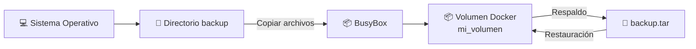

# 💾 Laboratorio: Respaldo y Restauración de Volúmenes Docker

> [!NOTE]
> **Curso:** Prácticas de DevOps utilizando Docker y GitFlow  
> **Unidad:** Persistencia de datos con Docker Volumes  
> **Duración estimada:** 45 minutos  
> **Nivel:** Intermedio

---

# 🎯 Objetivos de aprendizaje

Al finalizar este laboratorio será capaz de:

- ✅ Crear un volumen Docker para almacenamiento persistente.
- ✅ Copiar información desde el sistema anfitrión hacia un volumen Docker.
- ✅ Verificar el contenido almacenado dentro de un volumen.
- ✅ Generar un respaldo (*backup*) utilizando un contenedor temporal.
- ✅ Simular la pérdida de información.
- ✅ Restaurar el contenido del volumen a partir de un archivo de respaldo.

---

# 📖 Introducción

En entornos DevOps es fundamental proteger la información almacenada por las aplicaciones. Docker proporciona **volúmenes** que permiten conservar datos incluso cuando un contenedor es eliminado.

En este laboratorio se utilizará un contenedor **BusyBox** para realizar tareas de copia, respaldo y restauración de un volumen Docker, simulando un procedimiento básico de recuperación ante fallos.

---

# 🏗️ Arquitectura del laboratorio



---

# 📋 Requisitos

Antes de iniciar el laboratorio verifique que dispone de:

- 🐳 Docker Engine instalado.
- 💻 Terminal Linux.
- 📦 Imagen **BusyBox** (Docker la descargará automáticamente si no existe).
- 📂 Permisos para crear directorios en el sistema operativo.

---

# 📁 Parte 1. Preparación del entorno

En esta primera actividad se preparará un conjunto de archivos que posteriormente serán copiados hacia un volumen Docker.

---

## ▶️ Paso 1. Crear el directorio de trabajo

```bash
mkdir backup
```

---

## ▶️ Paso 2. Definir la ruta del directorio

```bash
BACKUP_DIR=$(pwd)/backup
```

> [!TIP]
> La variable **BACKUP_DIR** almacenará la ruta absoluta del directorio donde se guardarán los respaldos.

Puede verificar su contenido mediante:

```bash
echo $BACKUP_DIR
```

---

## ▶️ Paso 3. Ingresar al directorio

```bash
cd backup
```

---

## ▶️ Paso 4. Crear archivos de prueba

```bash
touch archivo_{1,2,3,4,5,6,7,8,9}.txt
```

---

## ▶️ Paso 5. Verificar los archivos creados

```bash
ls
```

Resultado esperado:

```text
archivo_1.txt
archivo_2.txt
...
archivo_9.txt
```

---

## ▶️ Paso 6. Regresar al directorio principal

```bash
cd ..
```

---

# 📥 Parte 2. Copiar archivos hacia un volumen Docker

En esta actividad se copiarán los archivos creados hacia un volumen denominado **mi_volumen**.

---

## ▶️ Paso 1. Copiar la información

```bash
docker run --rm \
-v mi_volumen:/data \
-v "$BACKUP_DIR":/backup \
busybox \
sh -c "cp /backup/* /data"
```

### 🔍 ¿Qué hace este comando?

| Elemento | Descripción |
|----------|-------------|
| `--rm` | Elimina automáticamente el contenedor al finalizar. |
| `-v mi_volumen:/data` | Monta el volumen mi_volumen. |
| `-v "$BACKUP_DIR":/backup` | Monta el directorio del sistema operativo. |
| `cp /backup/* /data` | Copia todos los archivos al volumen mi_volumen. |

---

## ▶️ Paso 2. Verificar el contenido del volumen

```bash
docker run --rm \
-v mi_volumen:/data \
busybox \
sh -c "ls -l /data"
```

Resultado esperado:

```text
archivo_1.txt
archivo_2.txt
...
archivo_9.txt
```

---

# 💾 Parte 3. Crear un respaldo del volumen

En esta actividad se generará un archivo comprimido con el contenido del volumen Docker.

---

## ▶️ Paso 1. Crear el respaldo

```bash
docker run --rm \
-v mi_volumen:/data \
-v "$BACKUP_DIR":/backup \
busybox \
sh -c "tar cvf /backup/backup.tar /data"
```

Durante la ejecución se mostrarán los archivos incluidos en el respaldo.

---

## ▶️ Paso 2. Verificar el respaldo

```bash
ls backup
```

Resultado esperado:

```text
archivo_1.txt
archivo_2.txt
...
archivo_9.txt

backup.tar
```

> [!IMPORTANT]
> El archivo **backup.tar** constituye el respaldo completo del volumen Docker.

---

# 🗑️ Parte 4. Simular la pérdida de información

Para comprobar el procedimiento de recuperación, se eliminará todo el contenido del volumen.

---

## ▶️ Paso 1. Borrar los archivos

```bash
docker run --rm \
-v mi_volumen:/data \
busybox \
sh -c "rm -rf /data/*"
```

---

## ▶️ Paso 2. Verificar el volumen

```bash
docker run --rm \
-v mi_volumen:/data \
busybox \
sh -c "ls -l /data"
```

Resultado esperado:

```text
total 0
```

---

# ♻️ Parte 5. Restaurar el volumen

En esta actividad se restaurará la información utilizando el respaldo previamente generado.

---

## ▶️ Paso 1. Restaurar los datos

```bash
docker run --rm \
-v mi_volumen:/data \
-v "$BACKUP_DIR":/backup \
busybox \
sh -c "tar xvf /backup/backup.tar -C /"
```

Durante el proceso se mostrarán los archivos recuperados.

---

## ▶️ Paso 2. Verificar nuevamente el contenido

```bash
docker run --rm \
-v mi_volumen:/data \
busybox \
sh -c "ls -l /data"
```

Resultado esperado:

```text
archivo_1.txt
archivo_2.txt
...
archivo_9.txt
```

Todos los archivos deberán encontrarse nuevamente disponibles.

---

# 🔄 Flujo del proceso


---

# 📚 Resumen de comandos

| Comando | Descripción |
|----------|-------------|
| `mkdir backup` | Crea el directorio para almacenar archivos y respaldos. |
| `touch archivo_{1..9}.txt` | Genera archivos de prueba. |
| `docker run ... cp` | Copia archivos desde el sistema anfitrión hacia el volumen. |
| `docker run ... ls -l /data` | Verifica el contenido del volumen. |
| `docker run ... tar cvf` | Genera un respaldo del volumen. |
| `docker run ... rm -rf /data/*` | Elimina el contenido del volumen. |
| `docker run ... tar xvf` | Restaura el volumen desde el respaldo. |

---

# ⭐ Buenas prácticas DevOps

- 📦 Utilice volúmenes Docker para almacenar información persistente.
- 💾 Realice respaldos periódicos de los volúmenes críticos.
- 📂 Almacene los archivos de respaldo en una ubicación distinta al volumen original.
- 🔄 Verifique siempre la integridad de los respaldos antes de eliminar información.
- 📋 Automatice este procedimiento mediante scripts o pipelines de CI/CD cuando sea necesario.

---

# 🏆 Actividad de reflexión

Responda las siguientes preguntas:

1. ¿Cuál es la diferencia entre un **volumen Docker** y un **bind mount**?
2. ¿Por qué el respaldo se genera utilizando un contenedor temporal BusyBox?
3. ¿Qué ventajas ofrece almacenar el respaldo fuera del volumen Docker?
4. ¿Cómo podría automatizar este procedimiento mediante un pipeline de CI/CD?
5. ¿Qué ocurriría si el archivo `backup.tar` se almacenara dentro del mismo volumen que se desea respaldar?

---

# 🎓 Competencia DevOps

Al completar este laboratorio habrá adquirido las competencias necesarias para realizar procedimientos básicos de **respaldo y recuperación de información** utilizando volúmenes Docker, una práctica ampliamente utilizada para proteger datos persistentes en aplicaciones contenerizadas y entornos de producción.
